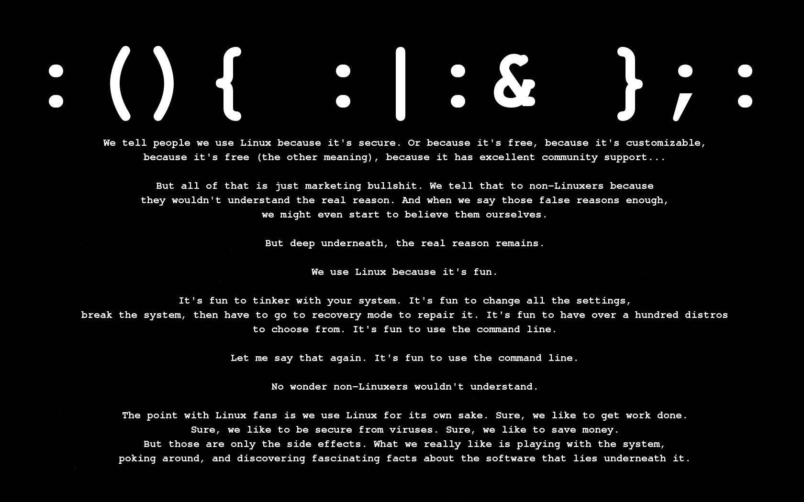
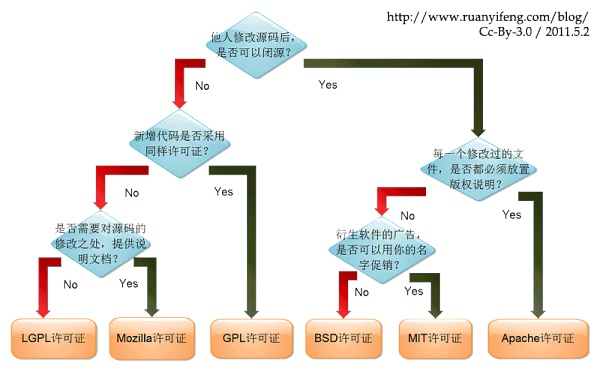
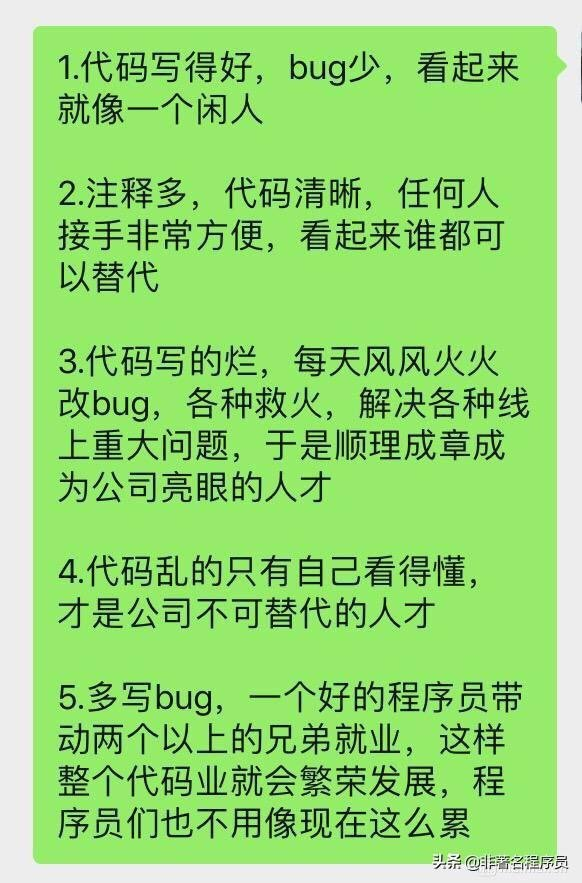
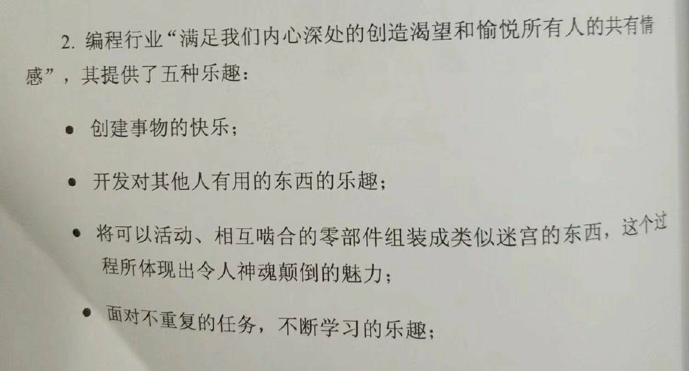

## 名词解释

> 双链路冗余备份

左边是第一个，立右边牌子的程序员是为了加“150m”这个提示，提升用户体验，但是他是个半吊子程序员，不会删左边的

> 术语 猫 Apache tomcat

## 面向对象

面向对象
 

## 数据库

 

 如果早上喝咖啡还不能让你清醒，那就试着删除生产数据库中的一个表。

## 软件开发

 

软件是怎样开发出来的

我都不相信，程序居然能启动了。。

## Linux

 

官方宣布自 2008 年Stack Overflow 平台上线以来，已经帮助超过 180 万人，让他们学会该如何退出 Vim

> 问：如何生成一个随机的字符串？答：让新手退出VIM 。

## 习惯

Tabs vs spaces 之争一比就弱了

斐波那契缩进

我希望的代码 VS 实际上我的代码

一个优秀的程序员，桌面一定井井有条，整洁干净；一个好的程序员，桌面一定有理可寻；一个烂程序员，桌面乱七八糟，鱼龙混杂

 

## 编程社区

据说这是 GitHub 网红的饭碗

> Github

┋◆冃.狌.交.伖，释.鲂.压.劦、棑.解.漃.瘼◆ 真 人】视||频. █网.址：wWw. GitHub 。Com◆┋
┋◆冃.狌.交.伖，释.鲂.压.劦、棑.解.漃.瘼◆ 真 人】视||频. █网.址：wWw. GuoKR 。Com◆┋
    

## 人物

ada lovelace

> 67岁的退休Playboy模特儿Lena重新拍了当年的照片。一个模特儿拍的写真在四十几年一直帮助着图象处理技术的发展。

## 创造

程序员创造了世界…

    You really wan to REST, but you need to organise all you have created. 是双关吐槽越来越多人用mongodb来搭REST api.

据说这是程序员梦寐以求的房子

## 项目

## 日常

一个直击灵魂的歌单…

