## 名词解释

> 双链路冗余备份

左边是第一个，立右边牌子的程序员是为了加“150m”这个提示，提升用户体验，但是他是个半吊子程序员，不会删左边的

> 术语 猫 Apache tomcat

## 面向对象

面向对象
 

## 数据库

 

## 软件开发

软件是怎样开发出来的

我都不相信，程序居然能启动了。。

## Linux

官方宣布自 2008 年 Stack Overflow 平台上线以来，已经帮助超过 180 万人，让他们学会该如何退出 Vim

## 习惯

Tabs vs spaces 之争一比就弱了

斐波那契缩进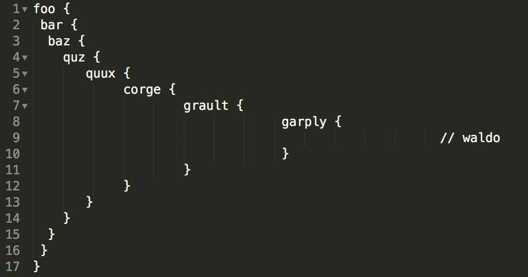

一个优秀的程序员，桌面一定井井有条，整洁干净；一个好的程序员，桌面一定有理可寻；一个烂程序员，桌面乱七八糟，鱼龙混杂

## 编程社区

据说这是 GitHub 网红的饭碗

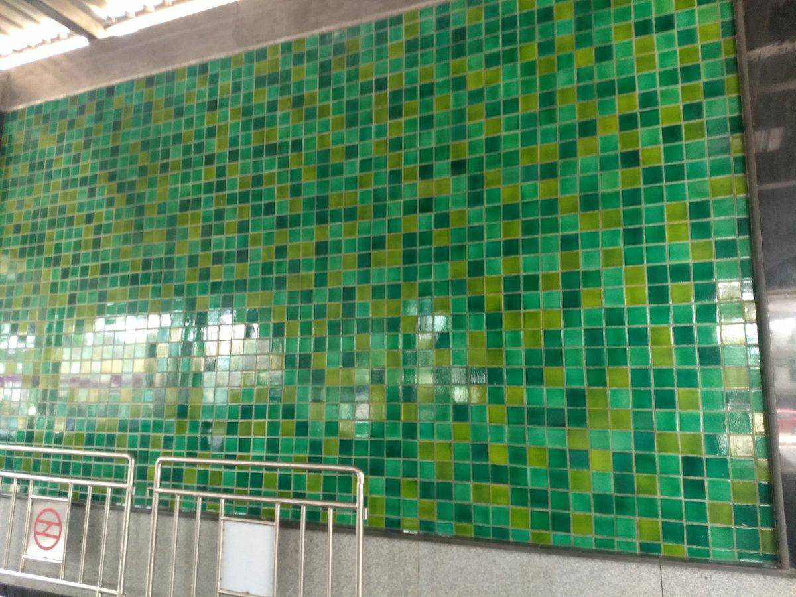

> Github

┋◆冃.狌.交.伖，释.鲂.压.劦、棑.解.漃.瘼◆ 真 人】视||频. █网.址：wWw. GitHub 。Com◆┋
┋◆冃.狌.交.伖，释.鲂.压.劦、棑.解.漃.瘼◆ 真 人】视||频. █网.址：wWw. GuoKR 。Com◆┋
    
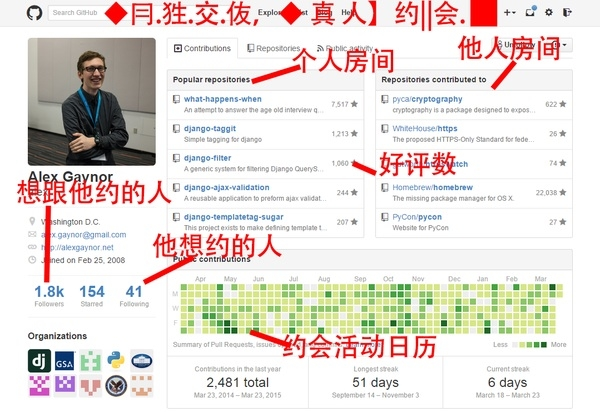

## 人物

ada lovelace

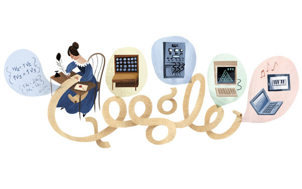

> 67岁的退休Playboy模特儿Lena重新拍了当年的照片。一个模特儿拍的写真在四十几年一直帮助着图象处理技术的发展。

## 创造

程序员创造了世界…

    You really wan to REST, but you need to organise all you have created. 是双关吐槽越来越多人用mongodb来搭REST api.

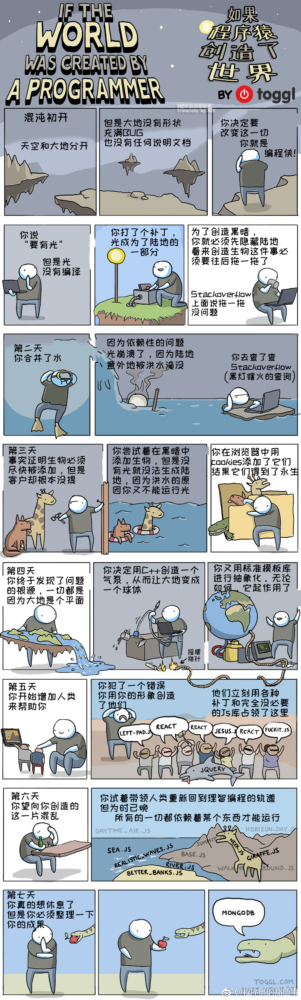

61. 

62. 

63. 

66. 

68. 我心里想做的程序架构 VS 我真正写出来的程序架构

72. 冰封王座

    

73. 

74. 

75. 

76. 

77. 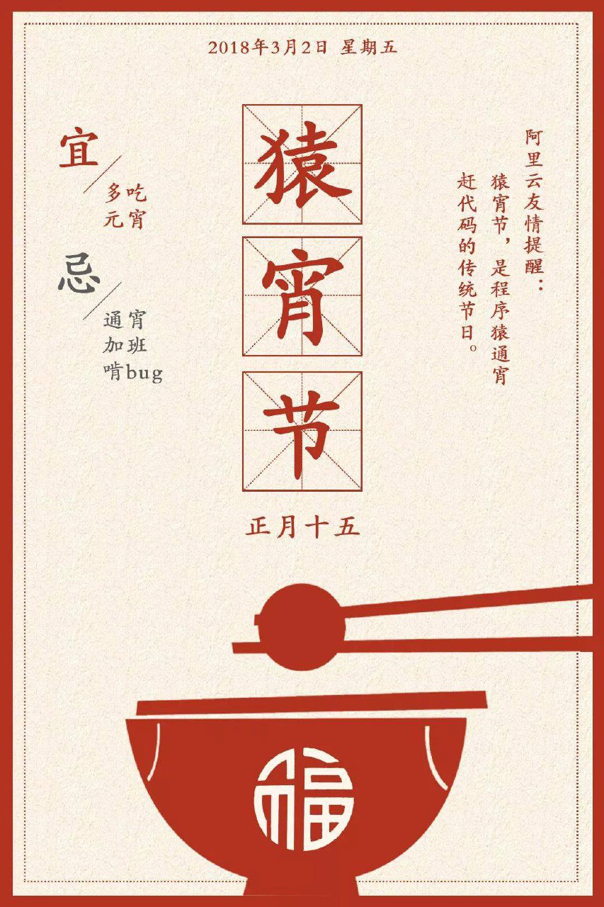

78. 

79. 

80. 

81. 

82. 

83. 我认为我的代码如何工作 VS 它实际上如何工作 

84. 当任务管理器没有反应的时候😃

85. 

86. 

87. 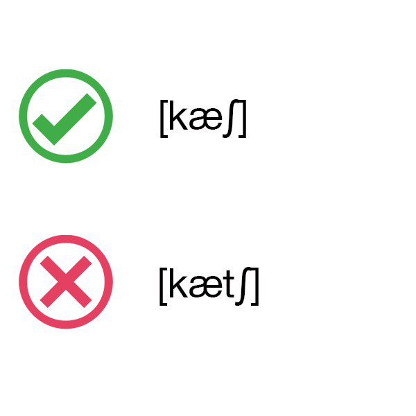

88. 

89. 据说这是程序员梦寐以求的房子

90. 

91. 当你写了个比项目代码还复杂的单元测试。

92. 

96. 

98. 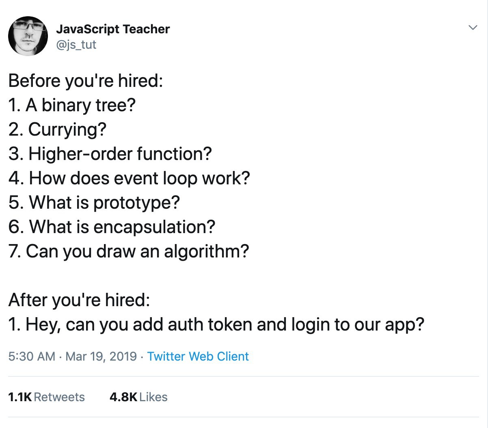

98. 

99. 我希望的代码 VS 实际上我的代码

101. 如果早上喝咖啡还不能让你清醒，那就试着删除生产数据库中的一个表。

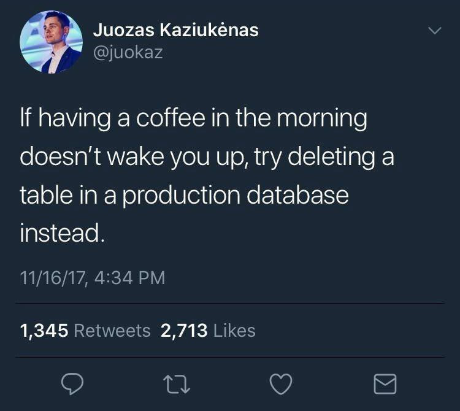

103. 

104. 这个故事告诉我们，病毒的性能关系到你是否能成功拿到钱。

100. 

101. 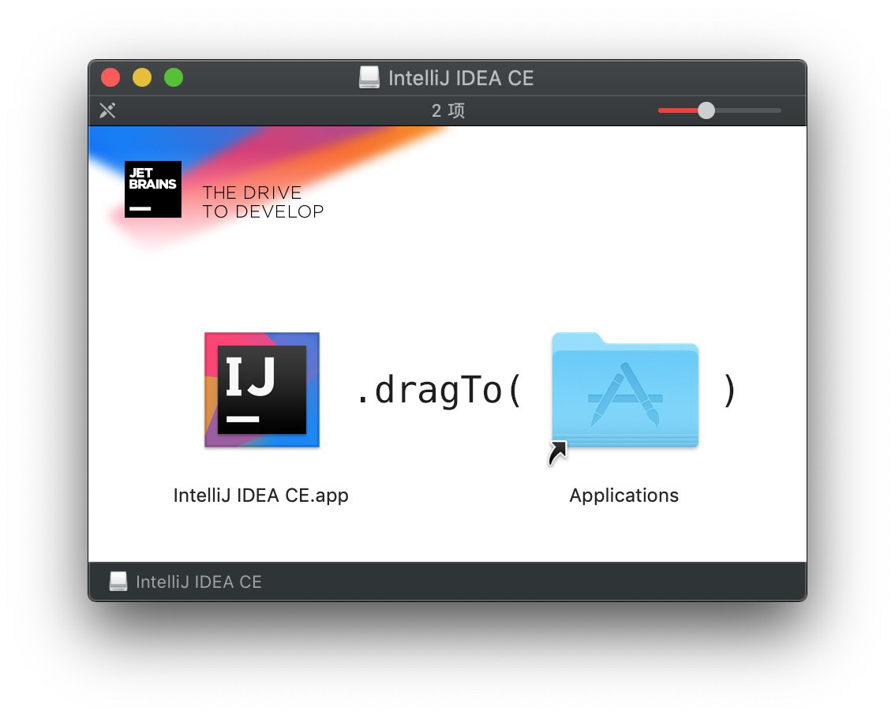

102. 

103. 一个直击灵魂的歌单…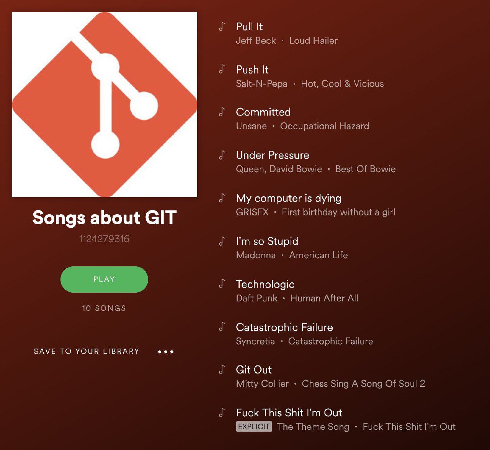

104. 

105. 

106. 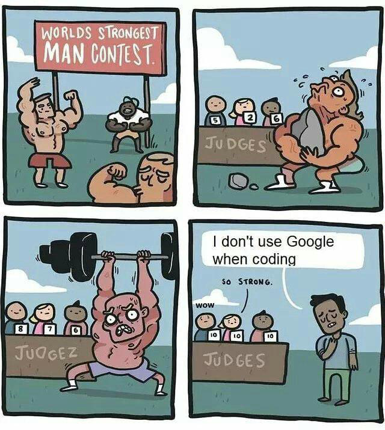