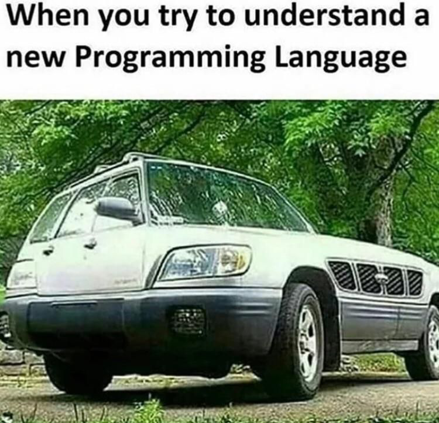
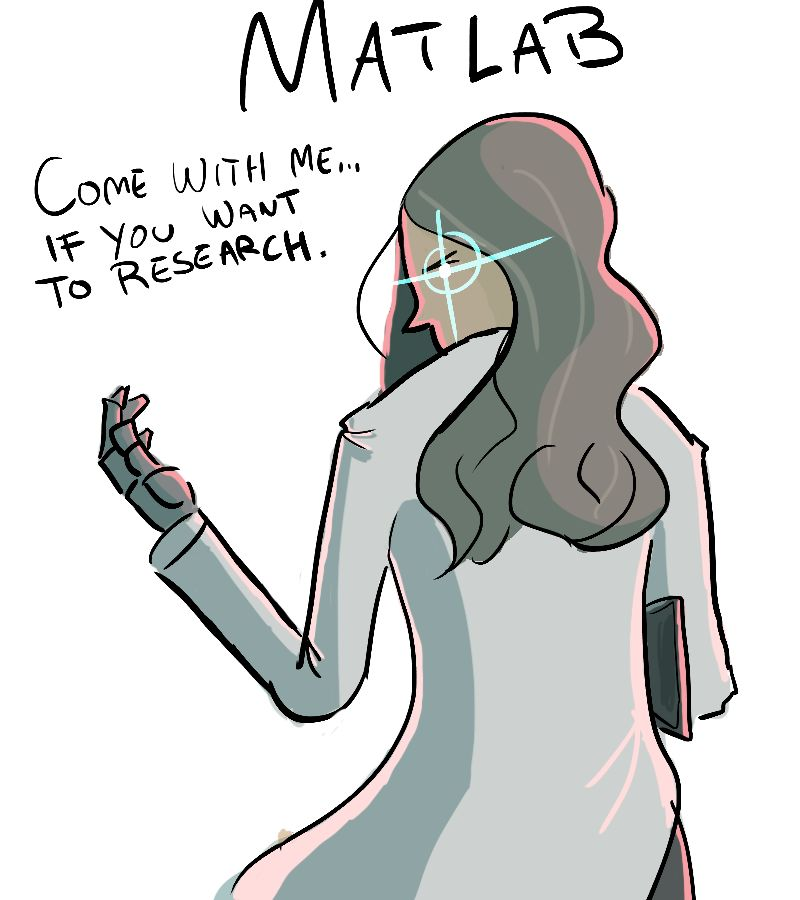

## Meme


<table><tr>
<td></td>
<td></td>
</tr></table> 


## 编程语言

《c++程序设计语言》比《c程序设计语言》厚了几倍…果然有了对象就麻烦很多么…

---

还没上大学的时候，高三暑假，跑到家那边的图书城想买传说中的C++的书，然后看到一本C#，我一看，嘿，这个++还写得挺艺术的，重叠起来了，于是把C#买了回来……

---

C++程序员看不起C 程序员， C 程序员看不起java程序员， java程序员看不起C#程序员，C#程序员看不起美工。周末了，美工带着妹子出去约会了，一群SX程序员还在加班。。

---

我很长一段时间以为你们说的vlog是vue的日志系统或者调试插件什么的，这个名词确实是我在即刻第一次听到…… 

---

你太 native 了🙄

我还 hybrid 呢😒

----

一百万只猴子，给他们一百万个键盘，其中的一个会写出Java程序，其它的写的都是Perl程序。

---

一个新手在试着修复一台坏了的LISP机器，他的方法就是反复关上电源然后打开。专家看到之后，严厉地批评说：“你这样是没用的，你必须要明白出错的深层次原因。” 专家关掉电源，然后打开。运行正常了。

---

某女:你能让这个论坛的人都吵起来,我今晚就跟你走. 某软件工程师:PHP是最好的语言! 某论坛炸锅了,各种吵架... 某女:服了你了,我们走吧 你想干啥都行. 某软件工程师:今天不行,我一定要说服他们,PHP必须是最好的语言 某女：....


> .NET VS Java


### 插画

<table><tr>
<td></td>
<td></td>
<td></td>
</tr>
<tr>
<td></td>
<td></td>
<td></td>
</tr>
<tr>
<td></td>
<td></td>
<td></td>
</tr>
<tr>
<td></td>
<td></td>
<td></td>
</tr>
<tr>
<td></td>
<td></td>
<td></td>
</tr>
<tr>
<td></td>
<td></td>
<td></td>
</tr>
<tr>
<td></td>
<td></td>
</tr>
</table> 

## Java


<table> 
<tr>
<td></td>
<td></td>
<td></td>
</tr>
</table> 

报警了 

## Python

我女儿刚刚学会走路，我是否该在她会识字后就立马教她Python？: https://www.zhihu.com/question/384252884

@一行玩python 太晚了，还没识字就该学，这样她人生中的母语就成了python，以后还得了

以后交流起来

1. 普通小孩都是：

- 爸爸，如果我考到满分，能不能给我买个玩具

python小孩：

```python3
if my_score == 100:
  my_toys.append("新玩具")
```

普通小孩都是：

- 爸爸，我不想起床不想起床不想起床不想起床。。。。。

python小孩：

```python3
print("爸爸，我不想起床"*100)
```

普通小孩都是：

- 爸爸，我想买冰淇淋吃。。。。。

python小孩：

```python3
while True：
  print("爸爸，我想买冰淇淋吃。。。。")
  if get("冰淇淋") or get("毒打")：
      break
```

中阶版来了：

普通小孩：

- 我来看看知乎上有什么好书推荐，浏览回答。。。。。

python小孩：

```python3
import requests
import re
import pandas as pd

headers = {
    'User-Agent':'Mozilla/5.0 (Windows NT 6.1; WOW64) AppleWebKit/537.36 (KHTML, like Gecko) Chrome/63.0.3239.132 Safari/537.36 QIHU 360SE'
}
pandas_data = []

def getBooksAndAnswers(qid):
    pass
    return max(book)

print("%s这本书出现次数最多，一定很值得看"%getBooksAndAnswers(281789365))
```

普通小孩：

- “这次考试复习的怎么样呀？“
- ”爸爸，我这次都复习两遍了，考试应该不成问题“

python小孩：

```python3
from sklearn import linear_model
linear = linear_model.LinearRegression()
linear.fit(x, y)
predicted_y = linear.predict(predict_x)

print("爸爸，我复习过一遍了，应该能考%d分"%predicted_y)
```

高阶版来了：

普通小孩：

- “你有freestyle吗？“
- ”淡黄的长裙，蓬松的头发“

python小孩：

```python
import pyttsx3
engine = pyttsx3.init()
engine.say("碍，碍，碍，准备好了没油，泥刊着歌免，塌，油"
           "长，油款，酒祥着歌晚，塌油大油院，腻们，莱着里"
           "，池饭，爵得，犯，恨浩痴，哎，我砍性，逆们，莱"
           "这里，池饭，救，像，卧给逆们蜡面，姨样恨开信，哎"
           "")
engine.runAndWait()
```

----

What do you call a snake that's exactly 3.14 meters long? π-thon


Python是比较容易学的语言


<table><tr>
<td></td>
<td></td>
</tr></table> 


## C/C++

有个人说自己准备离职，给新人交接了两天工作，然后新人也准备离职了。
我问是不是C++
是的
是不是有上万行十年历史的祖传代码是的
新人做出了最佳的选择


> C++ in 21 days

 

## PHP


## Perl

