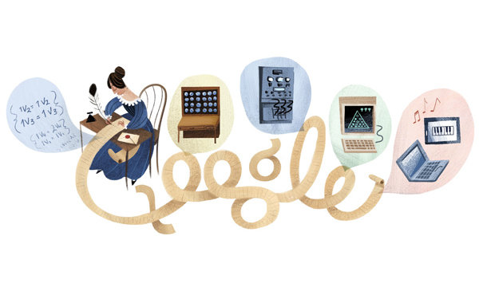
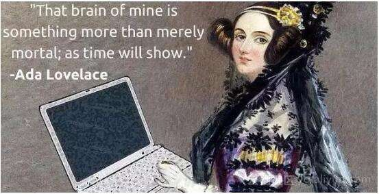
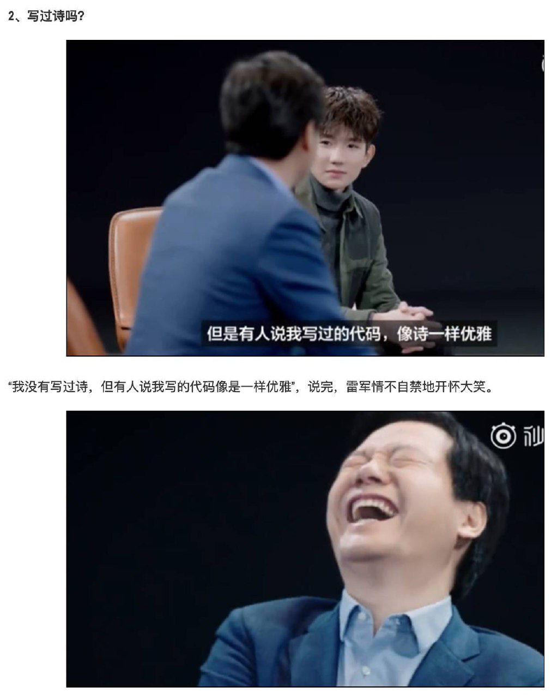
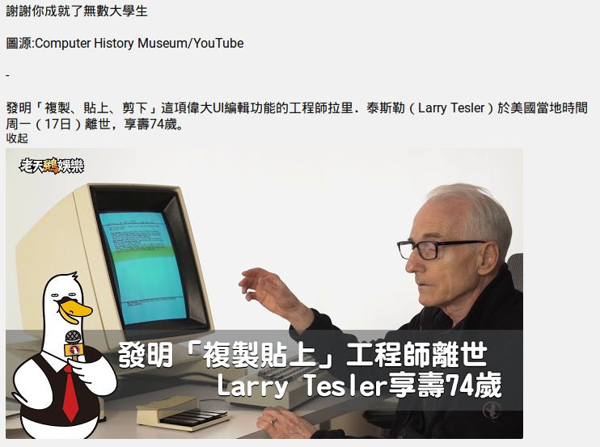

## 人物

> ada lovelace, 数学家，第一个程序员

海蒂拉玛（Hedy Lamarr），是一位出身富裕的犹太女孩，她美貌艳冠群芳，「我痛恨所有的传统，即使是艺术也一样，全裸算什么。」，还拍摄了主流电影第一场女性高潮的画面（《神魂颠倒》），震惊世界，接著她到好莱坞发展，事业冲天，连玛丽莲梦露都被比下去。但在海蒂拉玛那个年代，美貌就是原罪，所有人都认为她不过是个花瓶，但她其实是个又美又有发明头脑的女人。她与朋友想出来的「跳频」（自动钢琴的「跳频」原理应用）技术，最后成为当今 Wi-Fi、蓝牙、GPS 等技术的始祖（Wi-Fi、蓝牙、GPS 等通信技术的展频技术（Spread Spectrum）基础），我们现在能发的每一则短讯、每一张 IG 照片，全都归功于她。

> 67岁的退休Playboy模特儿Lena重新拍了当年的照片。一个模特儿拍的写真在四十几年一直帮助着图象处理技术的发展。

