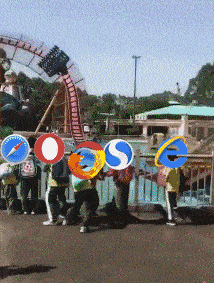

## HTML

用一句话总结了HTML,CSS,JS的关系。HTML是名词，JS是动词，CSS是形容词和副词

 > html是骨架，css是肌肉，js是血液

## Javascript

> http://vanilla-js.com/

 ( o_o) 诶，你这个地方好像写错了喔~
 (o_o ) 收到收到~

 `({}+{}).length`  NaN == NaN false

> 这是npm被黑的最惨的一次

 

> 我不是很懂 Node.js 社区的 DRY 文化
>
> https://www.v2ex.com/amp/t/448002

## 浏览器

> 电梯就像建筑里的加载页

### Flash

### IE

### Chrome

### Edge

### Firefox

## HTTP状态码

## 前端 VS 后端

## 网络设备

这是多少口交换机？ 

