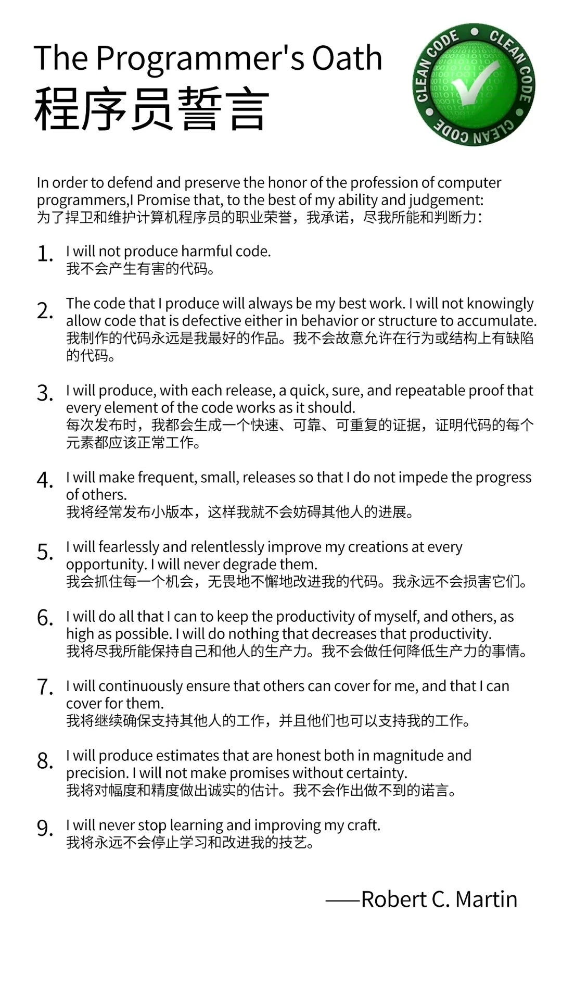
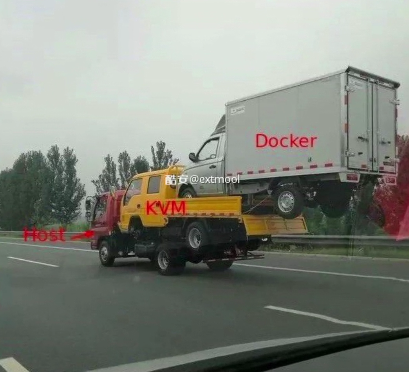
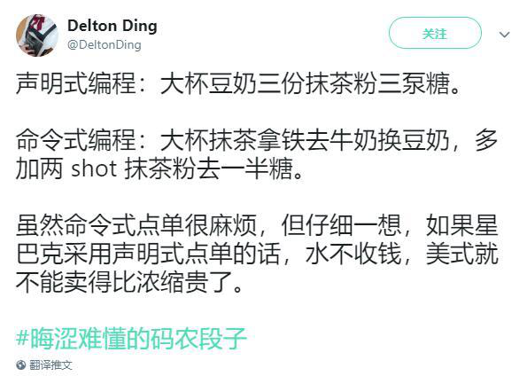
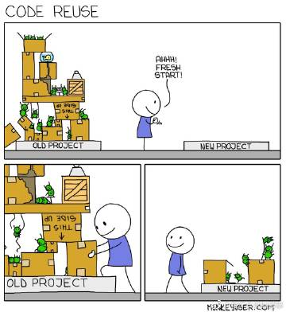
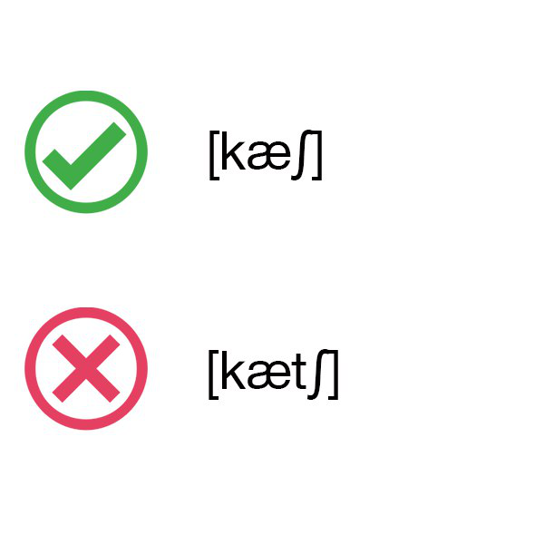
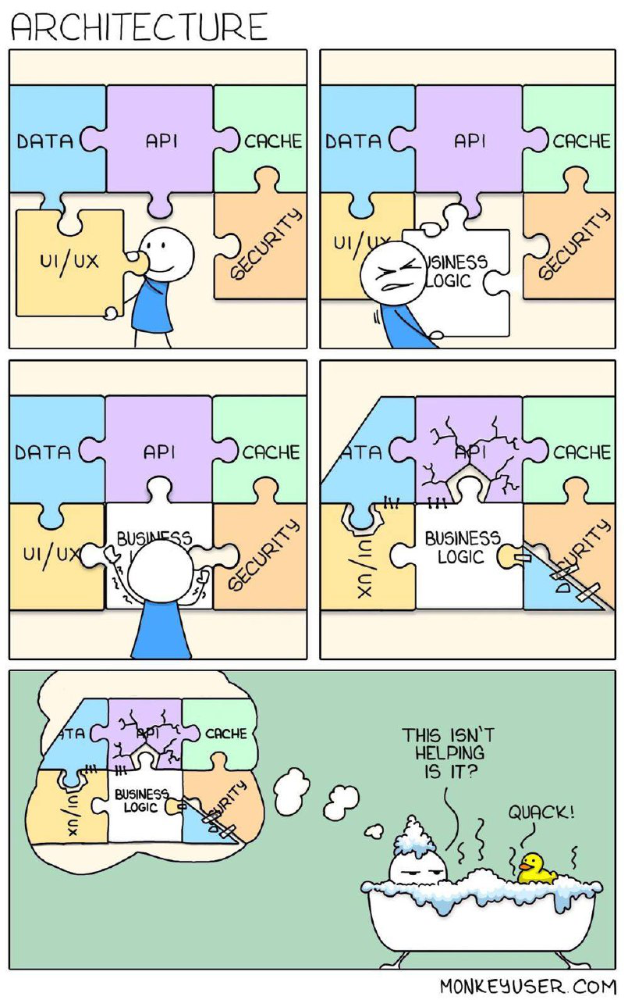
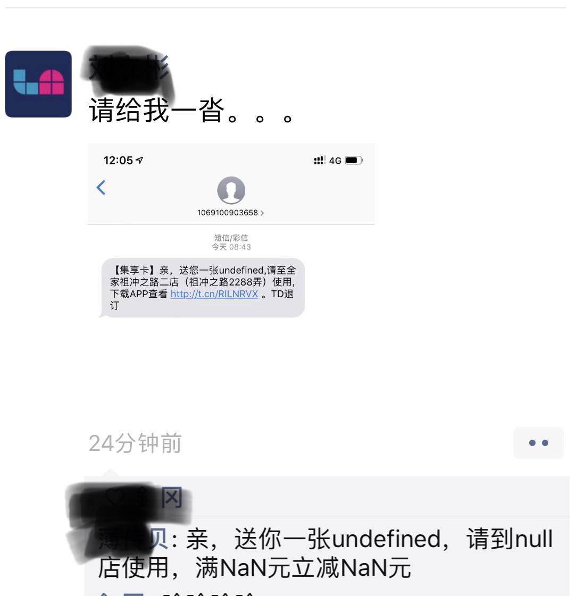
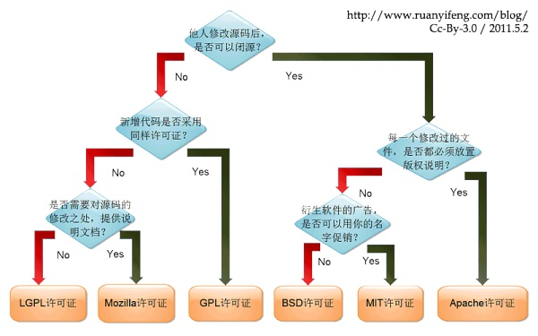
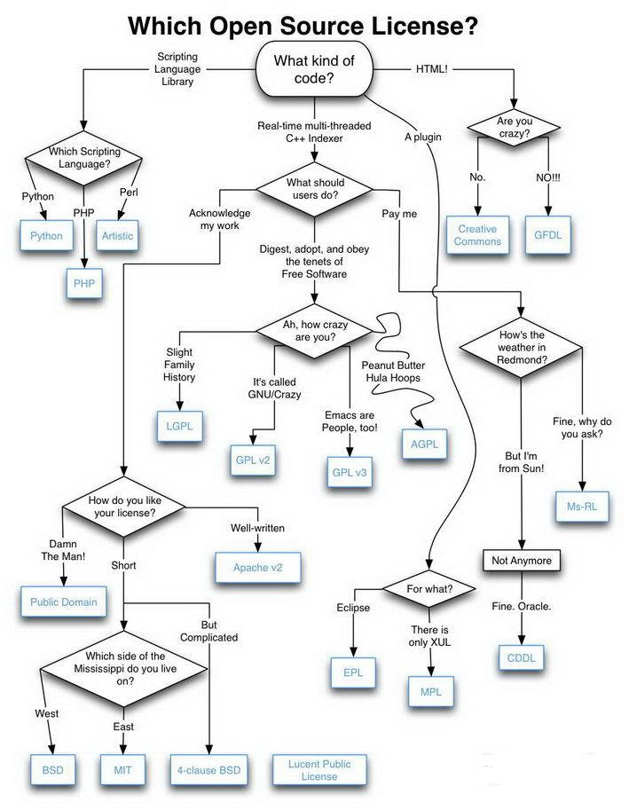

## 名词解释

声明式编程 命令式编程

> 星巴克两下糖、半糖、不加糖概念区分如下：
>
> 1. 大杯香草风味拿铁标准是4下糖；
> 2. 半糖就是放一半糖，即2下糖；
> 3. 如果不加糖就是普通的拿铁。

> 代码重用

双链路冗余备份, 左边是第一个，立右边牌子的程序员是为了加“150m”这个提示，提升用户体验，但是他是个半吊子程序员，不会删左边的

> 术语 猫 Apache tomcat

经常用到dashboard（仪表盘）这个词，对其中dash这个毫不相关的词根有些在意。原来dashboard最早是指马车前面用来挡泥的板子，到了汽车时代用途变成了安装各种仪表的面板，但还是保留了这个名字

Cache的读音

程序架构

一句话说明什么是面向对象？
 

> @我傻笑你跑掉
> 链接：https://www.zhihu.com/question/263789393/answer/274245200

假设你是一位妹子，你的男友沉迷游戏经常不接电话无故宕机，所以当你们约好下午逛街以后你要时不时地打个电话询问，看看他是不是还能正常提供服务，这叫心跳检测。

假设你是一位妹子，你想去逛街而你的男友A在打游戏不接电话，于是乎你把逛街的请求发给了替补男友B，从而保障服务不间断运行，这叫故障切换。

假设你是一位妹子，你有很多需要男朋友完成的事情，于是乎你跟A逛街旅游吃饭不可描述，而B只能陪你逛街，不能拥有全部男朋友的权利，这叫主从配置 master-slave。

假设你是一位妹子，你的需求太强烈以至于你的男友根本吃不消，于是乎你找了两个男朋友，一三五单号，二四六双号限行，从而减少一个男朋友所面临的压力，这叫负载均衡。

假设你是一位妹子，并且有多个男朋友，配合心跳检测与故障切换和负载均衡将会达到极致的体验，这叫集群LVS。注意，当需求单机可以处理的情况下不建议启用集群，会造成大量资源闲置，提高维护成本。

假设你是一位妹子，你的需求越来越高导致一个男朋友集群已经处理不了了，于是乎你又新增了另外几个，这叫多集群横向扩容，简称multi-cluster grid。

假设你是一位妹子，你的男朋友身体瘦弱从而无法满足需求，于是乎你买了很多大补产品帮你男朋友升级，从而提高单机容量，这叫纵向扩容。切记，纵向扩容的成本会越来越高而效果越来越不明显。

假设你是一位妹子，你跟男友经常出去游玩，情到深处想做点什么的时候却苦于没有tt，要去超市购买，于是乎你在你们经常去的地方都放置了tt，从而大幅度降低等待时间，这叫CDN。

假设你是一位妹子，你的男朋友英俊潇洒风流倜傥财大气粗对你专一，于是乎你遭到了女性B的敌视，B会以朋友名义在周末请求你男朋友修电脑、修冰箱，占用男朋友大量时间，造成男朋友无法为你服务，这叫拒绝服务攻击，简称DOS。

假设你是一位妹子，你因男朋友被一位女性敌视，但是你男朋友的处理能力十分强大，处理速度已经高于她的请求速度，于是她雇佣了一票女性来轮流麻烦你的男朋友，这叫分布式拒绝服务攻击，简称DDOS。

假设你是一位妹子，你发现男朋友总是在处理一些无关紧要的其它请求，于是乎你给男朋友列了一个白名单，要求他只处理白名单内的请求，而拒绝其它身份不明的人的要求，这叫访问控制，也叫会话跟踪。

假设你是一位妹子，你发现采取上述措施以后男朋友的处理请求并没有减少很多，于是你经过调查发现，有人伪造你的微信头像、昵称来向你的男朋友发起请求，这叫跨站点请求伪造，简称CSRF。

假设你是一位妹子，你收到了一份快递，于是你要求男朋友给你取快递，当你拿到快递以后发现有人给你邮寄了一封通篇辱骂的信件，这叫跨站点脚本攻击，简称XSS。请注意，对方完全可以给你邮寄微型窃听器来窃听你的隐私。

假设你是一位妹子，为了应对威胁，你要求你的男朋友对邮寄给你的邮件必须检查，这叫数据校验与过滤。

假设你是一位妹子，你的男朋友太优秀而遭人窥视，于是乎他们研究了一下你的男朋友，稍微修改了一点点生产出一个男朋友B，与你的男朋友百分之99相似，这不叫剽窃，这叫逆向工程，比如男朋友外挂。

假设你是一位妹子，你要求你的男朋友坚持十分钟，然后十五分钟继而二十分钟以测试你男朋友的极限在哪里，这叫压力测试。压力测试的目的是查看男朋友是否可以处理需求从而决定是否启用男朋友集群或提升男朋友处理能力，不要对线上运行的男朋友做压力测试，可能会造成宕机的后果，会血本无归的。

假设你是一位妹子，为了保证你男朋友的正常运行，于是乎你每天查看他的微信微博等社交资料来寻找可能产生问题的线索，这叫数据分析。

假设你是一位妹子，你的男朋友属于社交活跃选手，每天的微博知乎微信生产了大量信息，你发现自己的分析速度远远低于他生产的速度，于是乎你找来你的闺蜜一起分析，这叫并行计算。

假设你是一位妹子，你的男朋友太能折腾处处留情产生了天量的待处理信息，你和你的闺蜜们已经累趴也没赶上他创造的速度，于是你付费在知乎上找了20个小伙伴帮你一起分析，这叫云计算。

假设你是一位妹子，在使用云计算后获得了大量整理好的男朋友数据，这些数据如：

地点       活跃时间段       活跃次数

如家       xxxx            123次

汉庭       xxxx             45次

...

这叫数据统计。

假设你是一位妹子，你在得到男朋友经常出没的地点后，根据酒店、敏感时间段等信息确定男朋友应该是出轨了，这叫数据挖掘。

假设你是一位妹子，在分析男友的数据后，得知他下午又要出去开房，于是乎你在他准备出门前给他发了个短信，问他有没有带tt，没有的话可以在我这里买，这叫精准推送，需要配合数据挖掘。

假如你是一位妹子，你的男朋友总出去浪而各种出问题，于是乎你租了间屋子并准备好了所有需要的东西并告诉他，以后不用找酒店了，直接来我这屋子吧，什么都准备好了，这叫容器。

假如你是一位妹子，你每天都要和男朋友打通一次接口，这叫采集数据。你的男朋友用来连接你和他的工具，叫做接口“机”，你采集到的数据叫做“流”数据。你一天24小时不停地采，这叫实时数据采集。你决定开发新的接口来和男朋友交流，这叫虚拟化。你决定从不同的男友身上采集数据，你就是大数据中心。有一天你决定生一个宝宝，这叫大数据应用。宝宝生下来不知道是谁的，这叫大数据脱敏。但是从宝宝外观来看，黑色皮肤金色头发，这叫数据融合跨域建模。你决定把这个宝宝拿来展览收点门票，这叫大数据变现。（来自知乎作者@彩色郁金香）

---

老张爱喝茶，废话不说，煮开水。 出场人物：老张，水壶两把（普通水壶，简称水壶；会响的水壶，简称响水壶）。

1 老张把水壶放到火上，立等水开。（同步阻塞） 老张觉得自己有点傻

2 老张把水壶放到火上，去客厅看电视，时不时去厨房看看水开没有。（同步非阻塞） 老张还是觉得自己有点傻，于是变高端了，买了把会响笛的那种水壶。水开之后，能大声发出嘀~~~~的噪音。

3 老张把响水壶放到火上，立等水开。（异步阻塞） 老张觉得这样傻等意义不大

4 老张把响水壶放到火上，去客厅看电视，水壶响之前不再去看它了，响了再去拿壶。（异步非阻塞） 老张觉得自己聪明了。

所谓同步异步，只是对于水壶而言。 普通水壶，同步；响水壶，异步。 虽然都能干活，但响水壶可以在自己完工之后，提示老张水开了。这是普通水壶所不能及的。 同步只能让调用者去轮询自己（情况2中），造成老张效率的低下。

所谓阻塞非阻塞，仅仅对于老张而言。 立等的老张，阻塞；看电视的老张，非阻塞。 情况1和情况3中老张就是阻塞的，媳妇喊他都不知道。虽然3中响水壶是异步的，可对于立等的老张没有太大的意义。所以一般异步是配合非阻塞使用的，这样才能发挥异步的效用。

阻塞/同步：打一个电话一直到有人接为止
非阻塞：打一个电话没人接，每隔10分钟再打一次，知道有人接为止
异步：打一个电话没人接，转到语音邮箱留言（注册），然后等待对方回电（call back)

看起来异步是最高效，充分利用资源，可以想像整个系统能支持大规模并发。但问题是调试很麻烦，不知道什么时候call back。

## 开源协议

世界上流行的开源许可证大概有六种，在这些许可证之中做选择，也已经是复杂的事，但可以通过 5 个问题简单化处理：

他人修改软件后可以闭源吗？
├── YES！每一个改动是否必需放置版权声明？
│ ├── Yes！使用 👉 Apache License
│ └── No！衍生软件的广告是否可以用自己的署名？
│ ├── Yes！使用 👉 MIT License
│ └── No！使用 👉 BSD License
└── NO！新增代码采用同样许可证吗？
├── Yes！使用 👉 GLP License
└── NO！是否需要对原代码的改动提供文档？
├── Yes！使用 👉 Mozilla License
└── No！使用 👉 LGPL License

TFPL（Do What the Fuck You Want to Public License）

