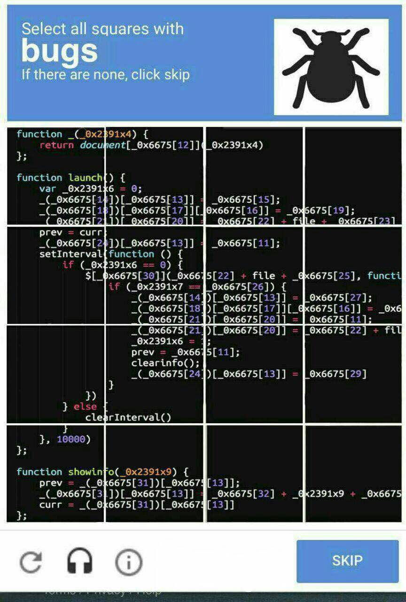
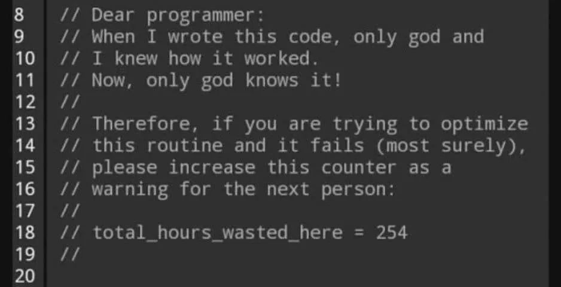
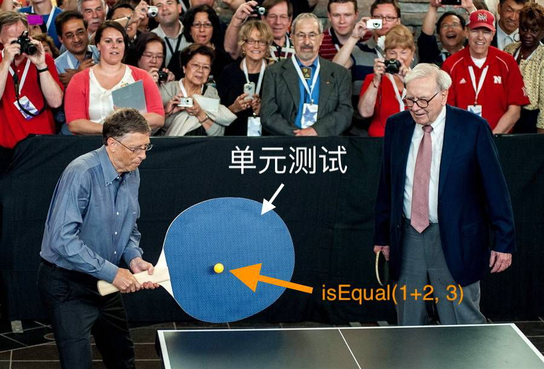
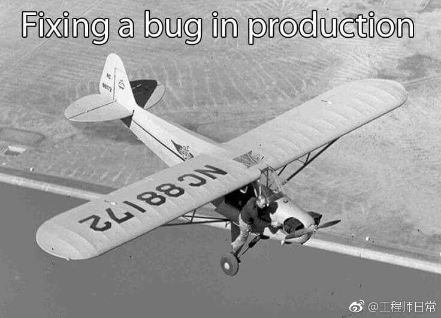

1.代码写得好，bug少，看起来就像一个闲人
2.注释多，代码清晰，任何人接手非常方便，看起来谁都可以替代
3.代码写的烂，每天风风火火改bug，各种救火，解决各种线上重大问题，于是顺理成章成为公司亮眼的人才
4.代码乱的只有自己看得懂，才是公司不可替代的人才
5.多写bug，一个好的程序员带动两个以上的兄弟就业，这样整个代码业就会繁荣发展，程序员们也不用像现在这么累

小王：写代码前会仔细思考，如果一个方法会被复用或对性能有很大影响，他会提前设计好架构，然后简洁优雅地实现出来。
小张：会事后思考，擅长分析性能瓶颈，根据工程规模进行重构，代码仓库保持得很干净。
小李：想到哪里写到哪里。
但因为git commit 数量比较多，小李被升职了。

---

程序员最讨厌康熙的哪个儿子？ 答：胤禩[yìn sì]，因为他是八阿哥。

老公程序员，今天去加班。穿袜子穿到一半突然又脱掉换了一双，嘴里自言自语：这个袜子快磨出洞了，不吉利，写代码容易出bug。(袜子破了等于漏洞)

---

程序员最恨四件事：别人不写文档；别人不写注释；自己写文档；自己写注释。

——Barret_China

程序猿最烦两件事，第一件事是别人要他给自己的代码写文档，第二件呢？是别人的程序没有留下文档。

---

如果公司的某位程序员小哥哥突然说了句 “这垃圾代码是谁……”(fuck shit bastard code)，但是没把话讲完就闭嘴的时候，很有可能是因为，他终于发现这段代码其实就是他自己写的…

【程序员被提bug之后的反应】

1.怎么可能； 2.在我这是好的，不信你来看看； 3.真是奇怪，刚刚还好好的； 4.肯定是数据问题； 5.你清下缓存试试； 6.重启下电脑试试； 7.你装的什么版本的类库（jdk） 8.这谁写的代码； 9.尼玛怎么还在用360安全浏览器 ； 10.用户不会像你这么操作的。11. 你个傻逼，你会用吗

---

前端工程师:我去交友网站找女朋友去了。朋友问:找到了么？工程师说:找到了他们页面的一个bug。

---

IT工程师=加班狂+程序员+测试工程师+实施工程师+网络工程师+电工+装卸工+搬运工+超人

---

代码有瑕疵，编译器肯定报错，说明编译器心胸狭窄，容不下一点错误。

---

我是个程序猿，一天我坐在路边一边喝水一边苦苦检查bug。这时一个乞丐在我边上坐下了，开始要饭，我觉得可怜，就给了他1块钱，然后接着调试程序。他可能生意不好，就无聊的看看我在干什么，然后过了一会，他幽幽的说，这里少了个分号。。。分号。。。分号。。。

一程序员家的水管坏了，他打电话叫来一个水管工修理。 水管工鼓捣了一个小时，终于把管子修好了，他递给程序员一张600元的帐单。 “600元！”程序员愤怒地说：“我当程序员一天都赚不了这么多钱！” “是啊。”水管工平静地说，“我当程序员的时候也是。”

---

夜班有神，其名为困。
困之重，眼睑不可控。
化而为虫，其名为 Bug。
Bug 之泛，遍布几万行也；
怒而飞，宕机数十台也。

------《捕 Bug 者说》

---

北京程序员XX遭遇车祸成植物人，医生说活下来希望只有万分之一，唤醒更为渺茫。他的Leader和亲人没放弃，他们根据xx视工作如命的作风，每天都在他身边念：“xx！IE6侧边栏又乱了，线上BUG啊！快起来改！”奇迹发生，xx醒来，第一句话：“我这是好的。”

---

虽我之死，有子存焉；子又生孙，孙又生子；子又有子，子又有孙；子子孙孙无穷匮也

## 表情包MEME

<table><tr>
<td></td>
<td></td>
</tr>
<tr>
<td></td>
<td></td>
</tr>
</table> 
一个实习生修补bug

> 来了一个新的 Pull Request ！！！居然还是一只bug开的车，过于真实，举报了

## 开发需求

> 杀一个程序员不需要用枪，改三次需求就可以了。

> and boom shakalaka

small changes

##   改bug的一天

曾遇到过一个 Bug，原本以为半个小时就能搞定，结果耗了我半天都没能解决，第二天，它自己好了…

> 当你写了一晚的程序，终于开始运行的时候…… 

> 每天困扰程序员的两大问题 

> 明明是一样的代码啊为什么我什么都没改就能跑了/为什么他能跑我不能跑
> 再不行就重启软件，实在不行重启电脑

## 报错Errors

> 代码编译成功 but 运行出错

> 遇到了 1 个问题，我想写 1 个程序来解决……
>
> 现在，我有 1 个问题，9 个错误，12 个警告。 

 

## 开发测试

当测试人员报告您的代码时，您的脸

> 版本提交给了测试

问：作为工程师，你最喜欢什么颜色？
答：#42c88a
问：为什么？
答：因为那是 CircleCI 测试通过的颜色。

当你写了个比项目代码还复杂的单元测试。

## 生产环境

 

> 热修复

<table><tr>
<td></td>
<td></td>
<td></td>
</tr></table> 
代码部署到生产环境，程序员的心情变化

## 软件开发

 

软件是怎样开发

我心里想做的程序架构 VS 我真正写出来的程序架构

## 特性

这不是bug，我是故意这么写的！对，不是bug，是特性！

出来的，我都不相信，程序居然能启动了。。

> 我认为我的代码如何工作 VS 它实际上如何工作 

