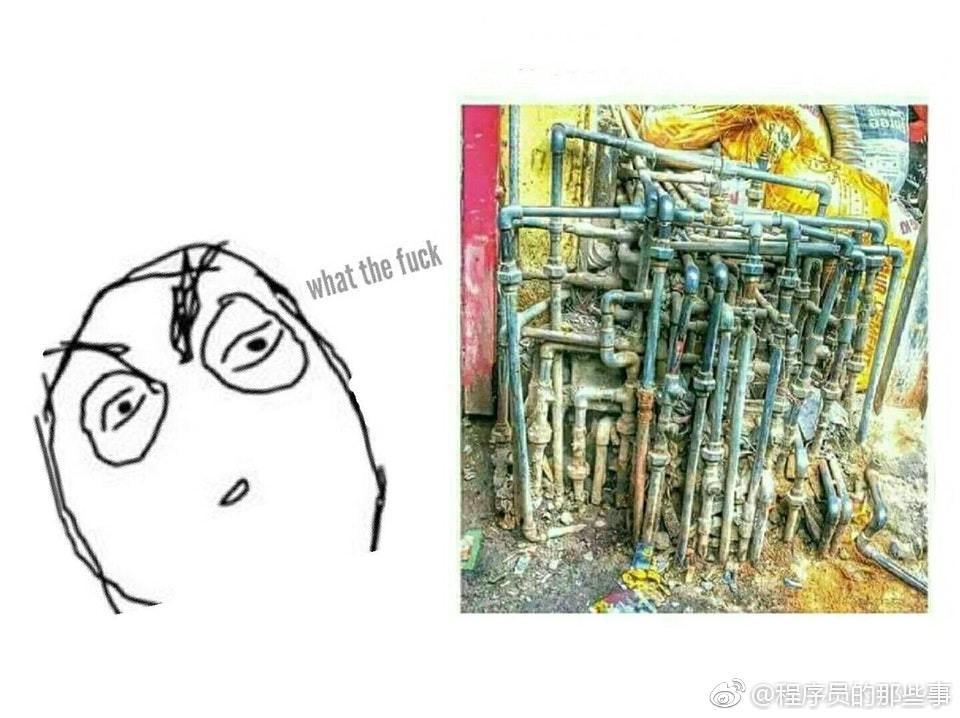

换一个电灯泡需要几个程序员？一个也不要，这是硬件问题。

换一个电灯泡需要几个微软程序员？一个也不要，他们会把黑暗变成标准然后告诉每个人：“我们就是这么设计的。”

换一个电灯泡需要几个C++程序员？你还在用面向过程的思维考虑问题。一个设计良好的电灯泡类必然封装了换灯泡的方法，所以你要做的就是调用“换电灯泡”方法。

---

一个微软工程师正走在路上，突然听到一只青蛙说：“如果你吻我一下的话，我就会变成漂亮的女人，我们可以结婚，从此幸福地生活在一起。”工程师看着青蛙想了一下，抓起它轻轻地放在自己的上衣口袋里。青蛙把头伸出来说：“怎么，你不准备吻我吗？”“是的”，工程师说：“我在微软工作，没有时间娶妻——不过有一只会说话的青蛙还是挺酷的。”

---

​	 两个食人族的人应聘进了IBM。 
　 公司人事主管知道这两个家伙每天都要吃人，于是警告他们：“如果你们胆敢在公司里吃一个人，你们就会立即被炒掉！” 
　 两个食人族唯唯喏喏地答应表示绝不会在公司里吃人。 
　 两个月过去了。公司里平安无事。 
　 突然有一天，公司发现负责打扫公司卫生的清洁工不见了。于是人事主管非常气愤，找来两个食人族怒斥，并当场炒掉了他们。
　 出了公司大门，一个食人族马上对另一个抱怨起来：“我一直警告你不要吃干活的人，你就是不听！我们两个月来每天吃一个经理，没人发现。你看现在吃了清洁工，他们马上就发现了！你真是个猪！” 
> 讽刺IBM人多项目杂什么大小单都接

	图①是初创公司的代码库，那图②是哪类公司呢？
	 
    

