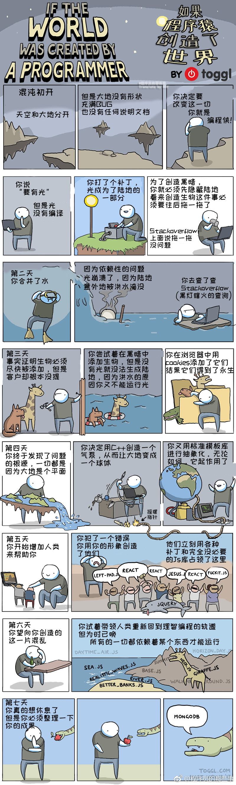
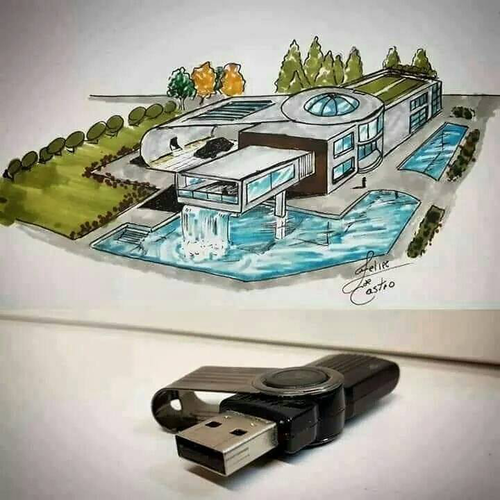
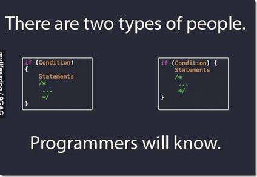
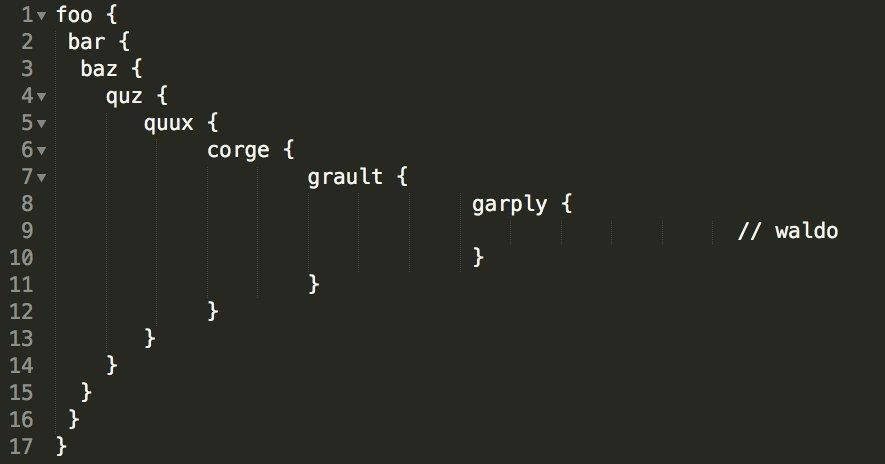
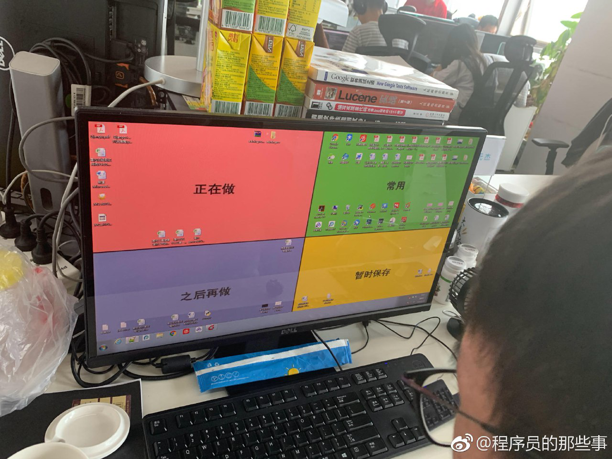
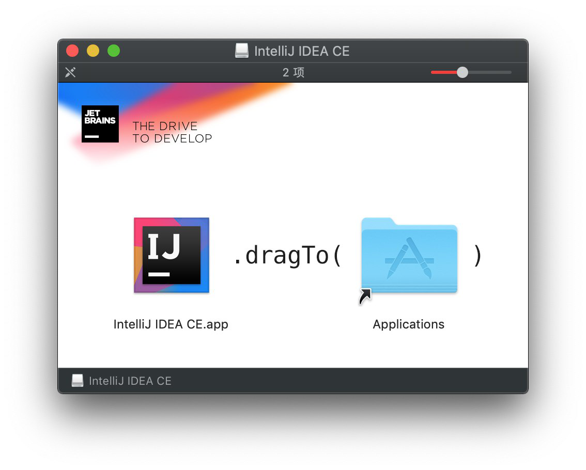
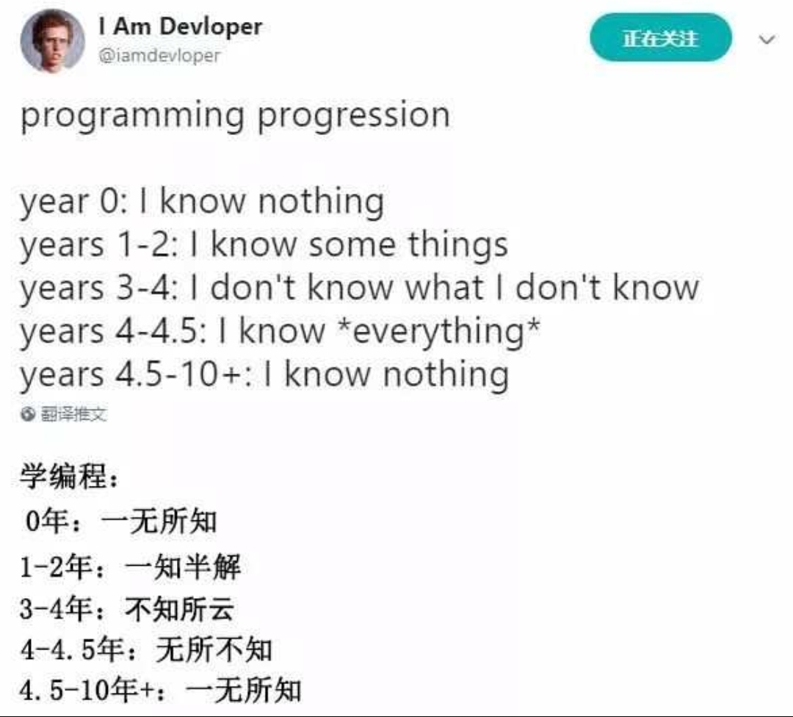
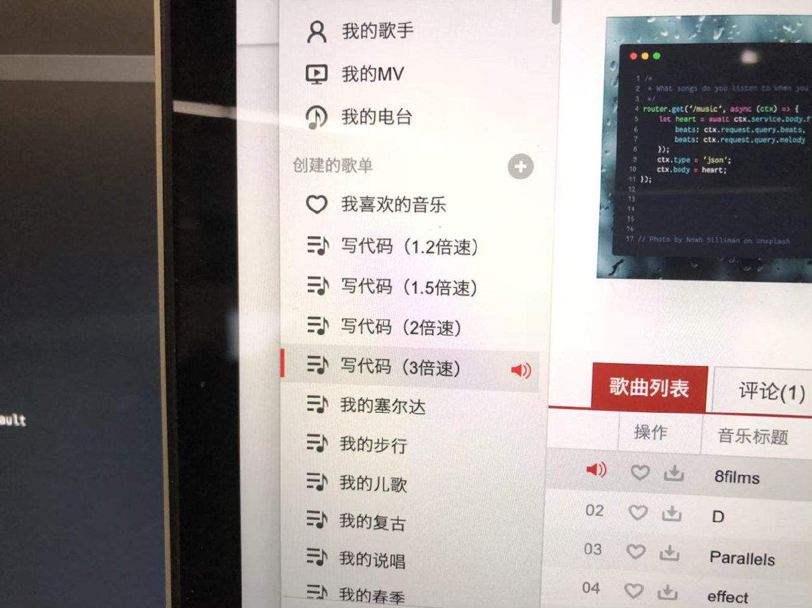
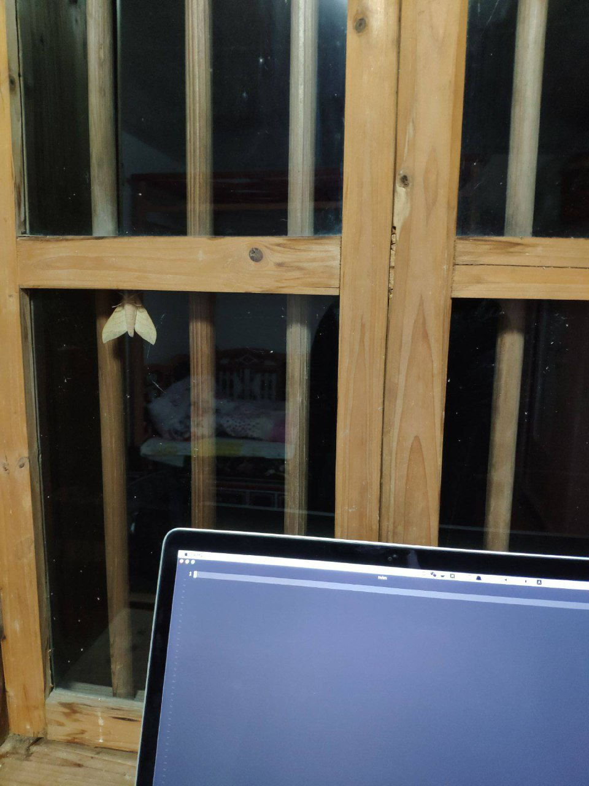
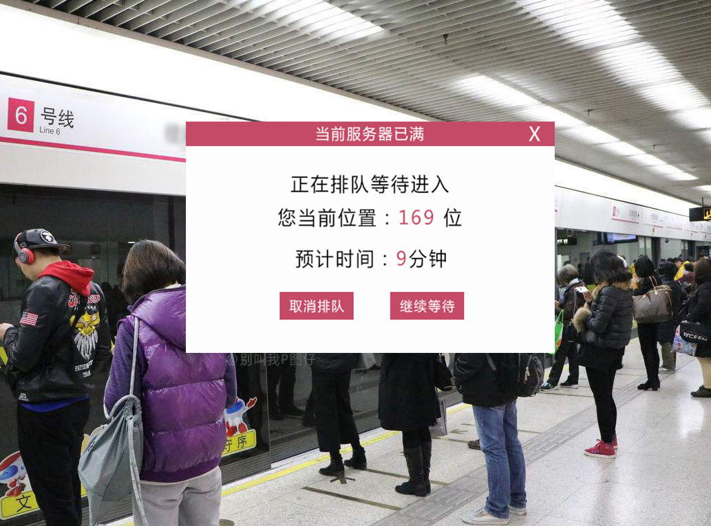

## 编程的乐趣

编程行业"满足我们内心深处的创造渴望和愉悦所有人的共有情感”，其提供了五种乐趣：

- 创建事物的快乐
- 开发对其他人有用的东西的乐趣；
- 将可以活动、相互啮合的零部件组装成类似迷宫的东西，这个过程所体现出令人神魂颠倒的魅力；
- ·面对不重复的任务，不断学习的乐趣；
- 工作在如此易于驾驭的介质上的乐趣——纯粹的思维活动，其存在、移动和运转方式完全不同于实际物体

程序员创造了世界…

> You really wan to REST, but you need to organise all you have created. 是双关吐槽越来越多人用mongodb来搭REST api.

> 据说这是程序员梦寐以求的房子

## 编程习惯

Tabs vs spaces 之争一比就弱了

斐波那契缩进

我希望的代码 VS 实际上我的代码

一个优秀的程序员，桌面一定井井有条，整洁干净；一个好的程序员，桌面一定有理可寻；一个烂程序员，桌面乱七八糟，鱼龙混杂

 

## 编程日常

一个直击灵魂的歌单…

> 真日常

程序员头疼的 4 种原因 

> 改bug

## 创意生活

> 冰封王座

