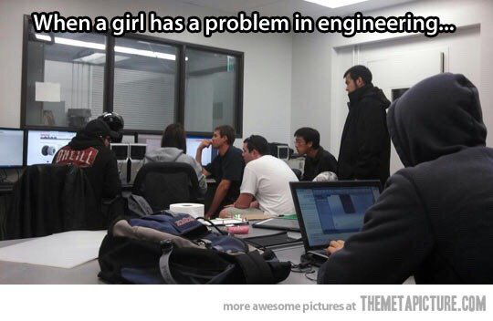
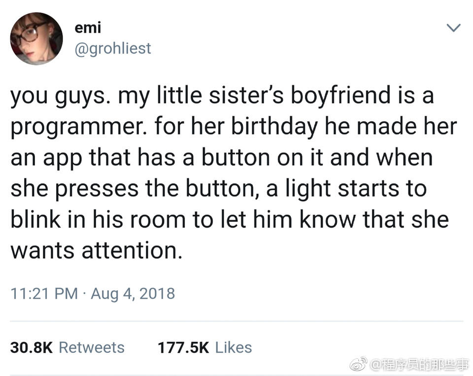
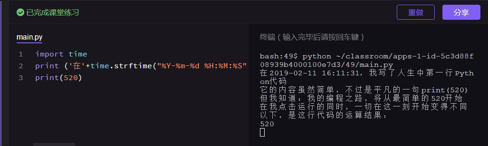
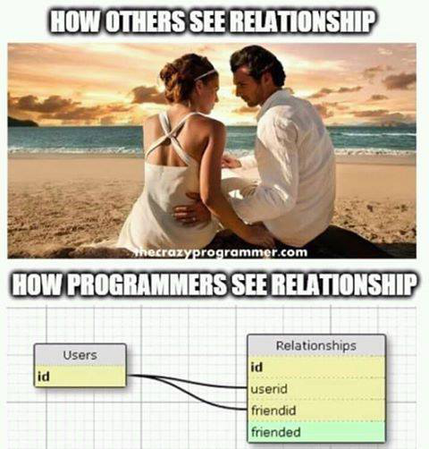
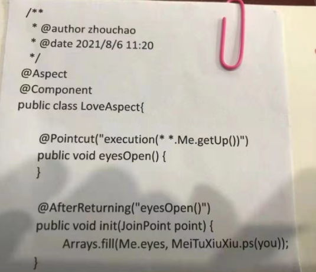

## Girl

## Relationship

嗨，各位。我小妹的男友是一个程序员 。为庆祝小妹生日，程序员男友做了一个的 App，上面有个按钮。当她摁下按钮时，男友房间有盏灯就开始闪烁，提醒他，女友需要关注。
> 女友按烦了想提个需求，这灯能根据心情自动闪烁吗？
> 不仅得懂应用开发，还得懂电路设计，还要懂嵌入式开发[doge] 我觉得我可以搞一下

 

<table><tr>
<td></td>
<td></td>
</tr></table> 

