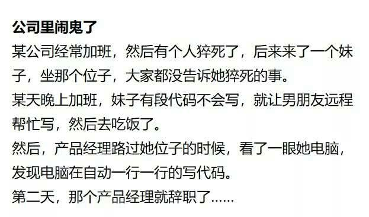
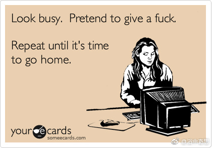

我花了1年6个月时间4万块钱培训了JAVA开发，刚培训完两个星期我就收到了美团网的offer。
我承认我不是班里学习最好的，但我却是班里第一个找到工作的而且还是个大厂我一直相信勤能补拙，只要有决心什么事都是可以做到的。
今天入职一个星期了，公司的人对我都很好！
还给我配了电动车和头盔还有大衣，不说了又接了个外卖。

----

面试造核弹，上班拧螺丝

---

上班时间挤时间摸鱼，
下班时间写代码都顾不上吃饭

---

产品经理有三宝：弹窗，浮层加引导。

UI 设计有三宝：透明，阴影加圆角。

老板有三宝：我想，我要，必须搞。

码农就一宝：这个需求做不了。

---

一个年轻的程序员和一个产品经理登上了一列在山里行驶的火车，他们发现列车上几乎都坐满了，只有两个在一起的空位，这个空位的对面是一个老奶奶和一个年轻漂亮的姑娘。两个上前坐了下来。程序员和那个姑娘他们比较暧昧地相互看对方。这时，火车进入山洞，车厢里一片漆黑。此时，只听见一个亲嘴的声音，随后就听到一个响亮的巴掌声。很快火车出了山洞，他们四个人都不说话。那个老奶奶在喃喃道，“这个年轻小伙怎么这么无礼，不过我很高兴我的孙女扇了一个巴掌”。产品经理在想，“没想到这个程序员居然这么大胆，敢去亲那姑娘，只可惜那姑娘打错了人，居然给打了我。” 漂亮的姑娘想，“他亲了我真好，希望我的祖母没有打疼他”。 程序员坐在那里露出了笑容，“生活真好啊。这一辈子能有几次机会可以在亲一个美女的同时打产品一巴掌啊！”

---

据说有一位软件工程师，一位硬件工程师和一位项目经理同坐车参加研讨会。不幸在从盘山公路下山时坏在半路上了。于是两位工程师和一位经理就如何修车的问题展开了讨论。硬件工程师说：“我可以用随身携带的瑞士军刀把车坏的部分拆下来，找出原因，排除故障。” 项目经理说：“根据经营管理学，应该召开会议，根据问题现状写出需求报告，制订计划，编写日程安排，逐步逼近，alpha测试，beta1测试和beta2测试解决问题。” 软件工程说：“咱们还是应该把车推回山顶再开下来，看看问题是否重复发生。”

---

【开发时间】项目经理: 如果我再给你一个人,那可以什么时候可以完工？程序员: 3个月吧！项目经理: 那给两个呢？程序员: 1个月吧！项目经理: 那100呢？程序员: 1年吧！项目经理: 那10000呢？程序员: 那我将永远无法完成任务。

---

终于可以连续写一周自己的代码了，真的太奢侈了。

---

有一天，程序猿们突然发现他们要涨的工资掉到井里啦！大家都很害怕，连忙一个吊着一个，从树上伸到井里去捞工资。正好他们摸到工资的时候，一个老程序员忽然兴奋的大叫：别蠢了，要涨的工资还好好的挂在天上呢！

---

如果一个足球界的人“猝死”了，会被怀疑和赌球有关；如果一个官员“猝死”了，会被怀疑和贪腐有关；如果一个农民”猝死”了，会被怀疑和拆迁有关；而如果一个程序员猝死了，那他真的猝死了。

## 职业&职位

### 产品经理

   

坑的最里面还有一个PM，PM挖的坑，Programmer正在填坑。

### 职业生涯

### 职业

### 工程师

网络工程师

> 全栈工程师

## 工作

上班时假装忙8小时比真的忙8小时更累

## 面试

我这里有个内推，30K起，要求1年经验就行，有html css基础就可以，应届生能力强也可以不要工作经验。朝九晚五，五险一金，15薪，各种节假日福利。
有兴趣的可以投简历到我邮箱，我会在明天中午之前公布是谁这么不要脸

----

面试官问我什么是红黑树，我说不太熟悉，就知道是一种平衡的二叉查找树，然后面试官问我怎么实现平衡的？我答不出来，就下一题了，最后问的差不多了，面试官问我，你有什么想问我的？我：什么是红黑树？面试官..也答不上来，支支吾吾半天说太久了都忘了[捂脸]我感觉我居然通过电面真是个奇迹。

> 面试的时候：
>
> - 写个二叉树？
> - 什么叫柯里化？
> - 什么是高阶函数？
> - 解释下循环的工作原理？
> - 能现场画一个算法吗……
>
> 入职后：
>
> - 帮我们的 App 写个登录功能吧。

## 着装

> 发现一个程序员家的(宝ᴗ宝)，这定制的衣服有特点……😊

问题来了，她爹/他妈是什么程序员？

## 996

> 如何鉴别996公司？

面试时观察一下，办公室鸦雀无声，办公桌整齐干净，会议室多数空着，员工面无表情的，那是965。
办公室热热闹闹，办公桌杂乱无章，会议室少数空着，员工嘻嘻哈哈的，那是996。
办公室人声鼎沸，办公桌堆满零食，会议室全部满着，员工勾肩搭背的，那是007。

