## 表情包

虽我之死，有子存焉；子又生孙，孙又生子；子又有子，子又有孙；子子孙孙无穷匮也

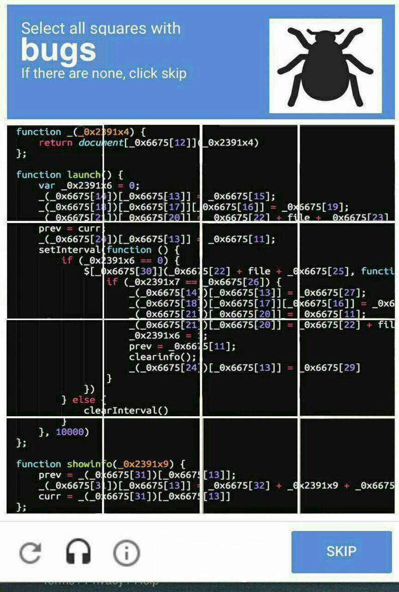

## Meme

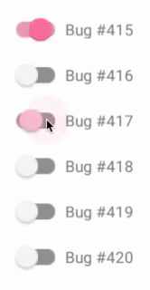

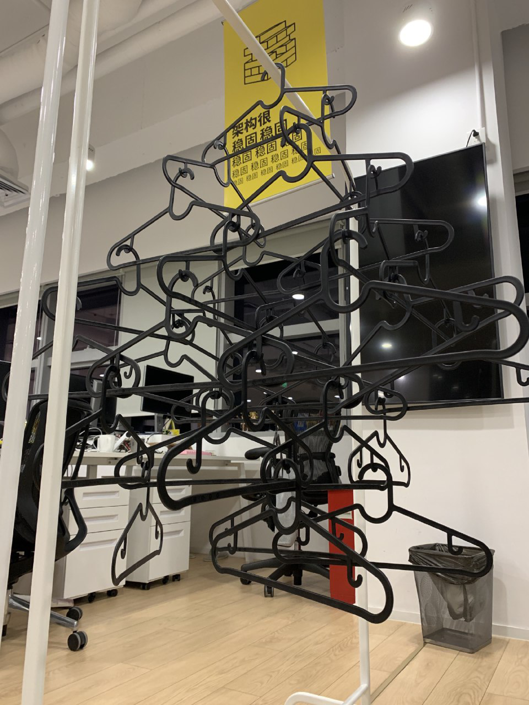

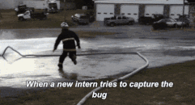

##   一个bug de 一天

曾遇到过一个 Bug，
原本以为半个小时就能搞定，
结果耗了我半天都没能解决，
第二天，
它自己好了…

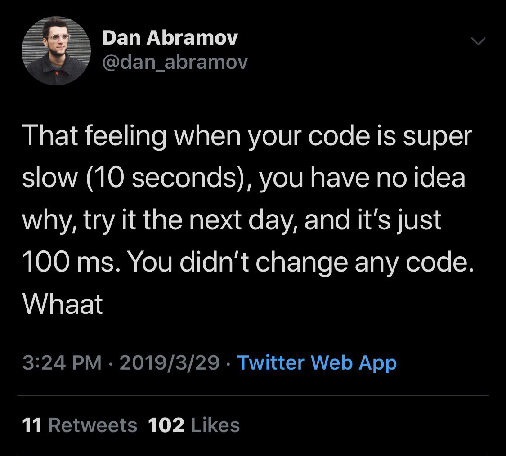

> 当你写了一晚的程序，终于开始运行的时候…… 

> 每天困扰程序员的两大问题 

> 明明是一样的代码啊为什么我什么都没改就能跑了/为什么他能跑我不能跑

> 再不行就重启软件，实在不行重启电脑

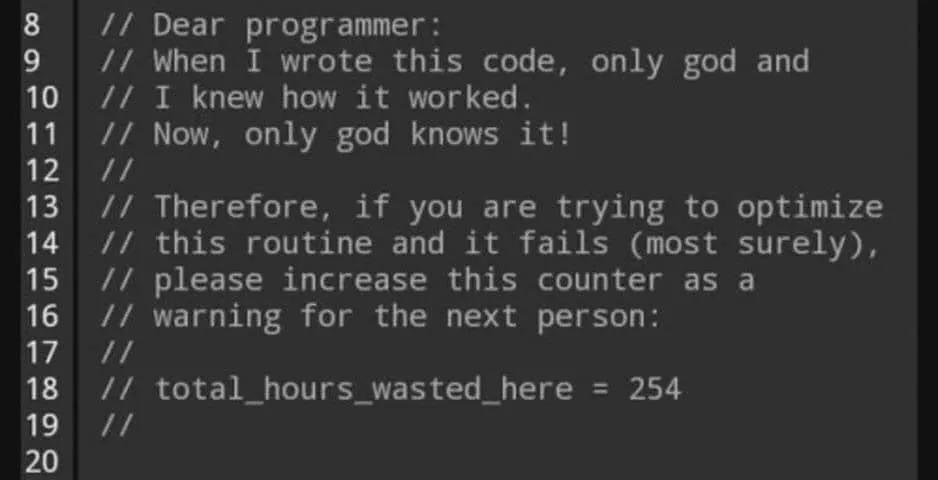

## Errors

> 我认为我的代码如何工作 VS 它实际上如何工作 

> 来了一个新的 Pull Request ！！！居然还是一只bug开的车，过于真实，举报了

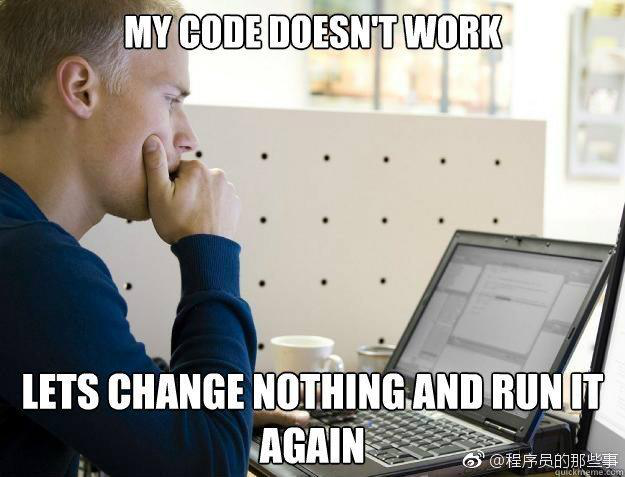

> 代码编译成功 but 运行出错

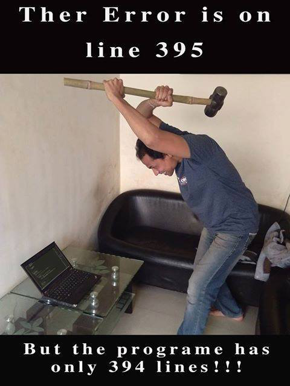

> 遇到了 1 个问题，我想写 1 个程序来解决……

> 现在，我有 1 个问题，9 个错误，12 个警告。 
 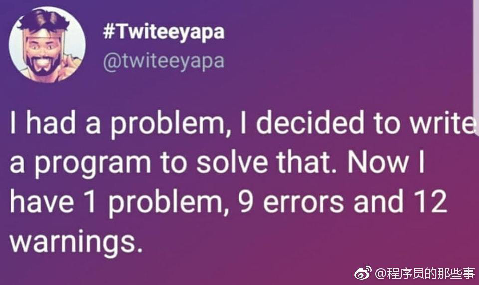

## 测试

当测试人员报告您的代码时，您的脸

> 版本提交给了测试

问：作为工程师，你最喜欢什么颜色？
    答：#42c88a
    问：为什么？
    答：因为那是 CircleCI 测试通过的颜色。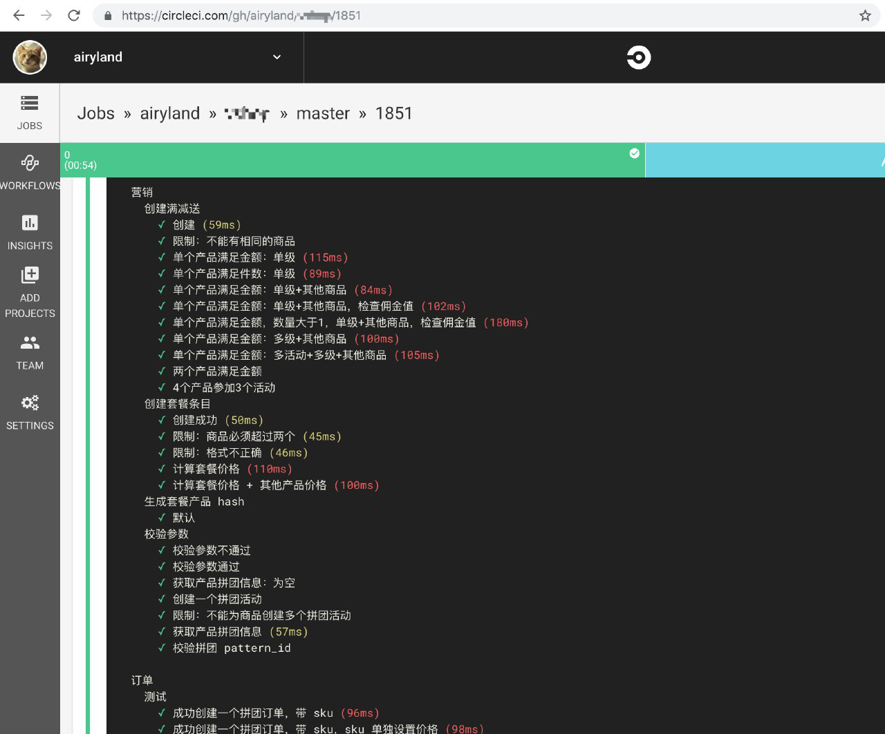

当你写了个比项目代码还复杂的单元测试。

## 生产环境

 

> 热修复

代码部署到生产环境，程序员的心情变化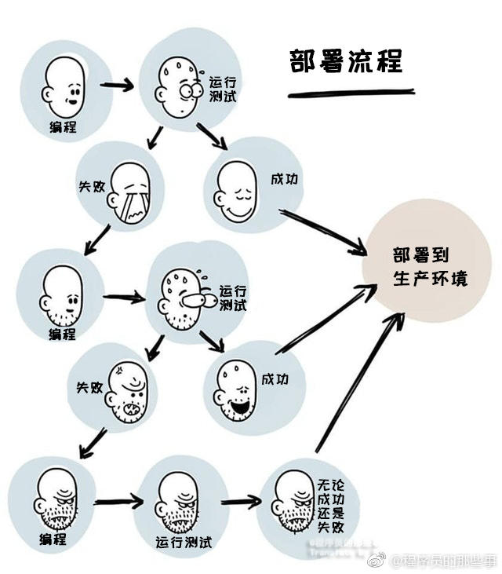

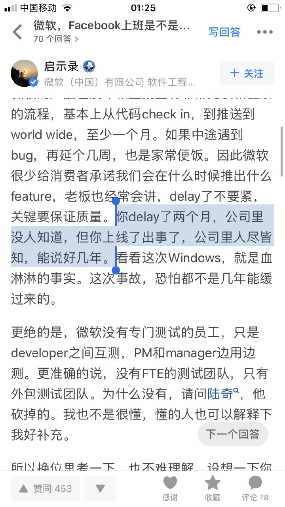

## 生活

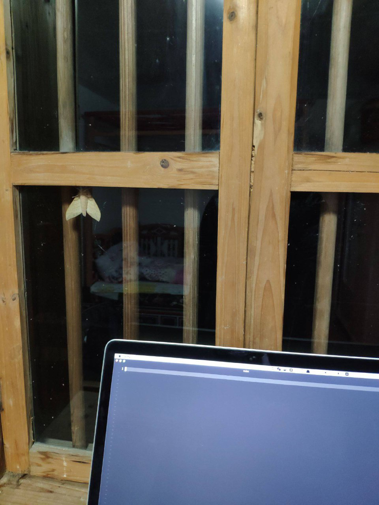

## 特性

这不是bug，我是故意这么写的！对，不是bug，是特性！
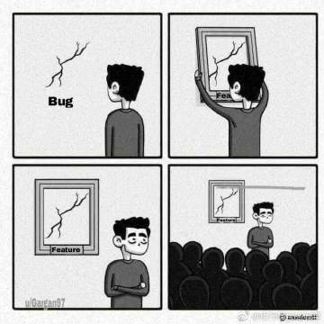

接手别人的项目发现Bug并成功改完之后......🐶🐶

多人经手过的项目代码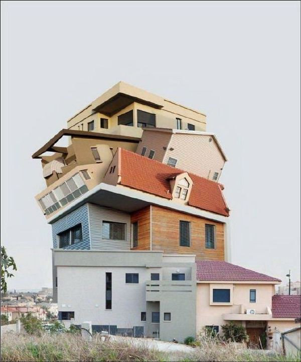

我心里想做的程序架构 VS 我真正写出来的程序架构

项目变得越来越大的原因..

