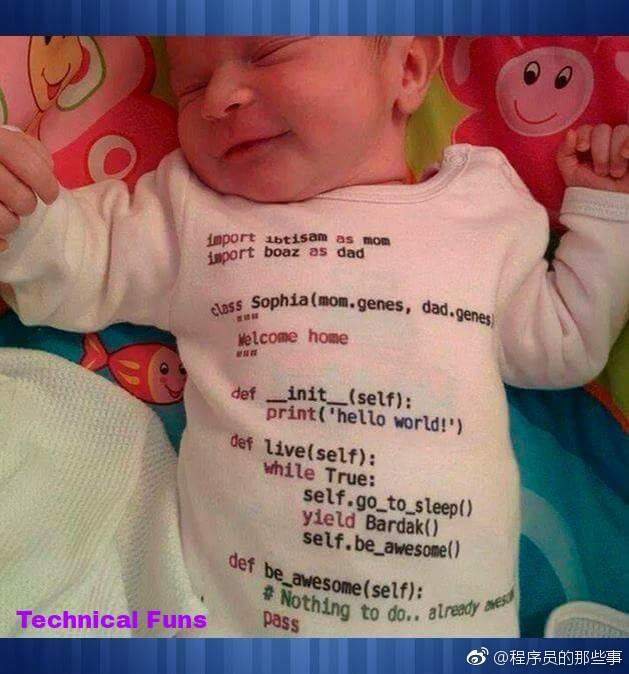
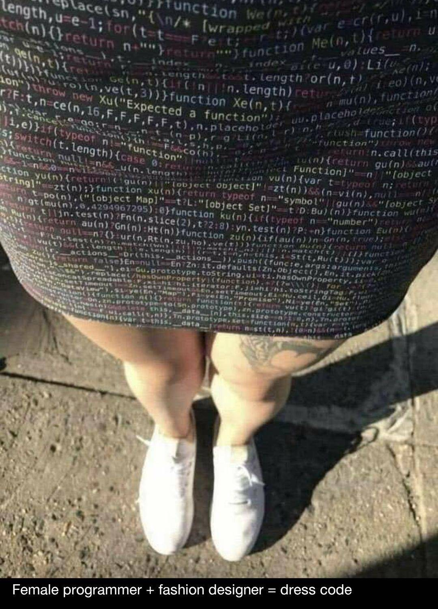
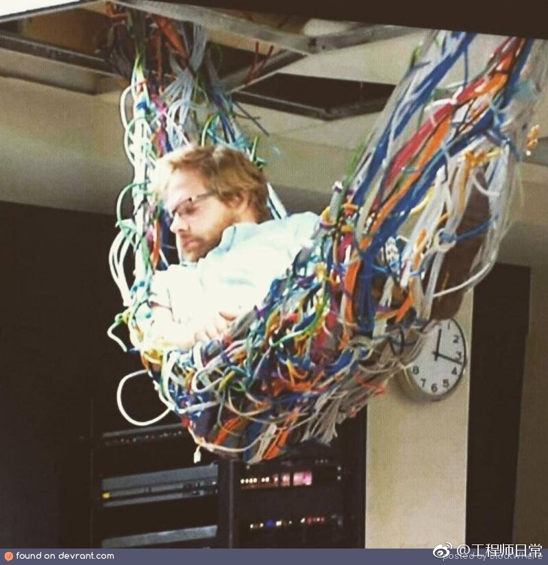
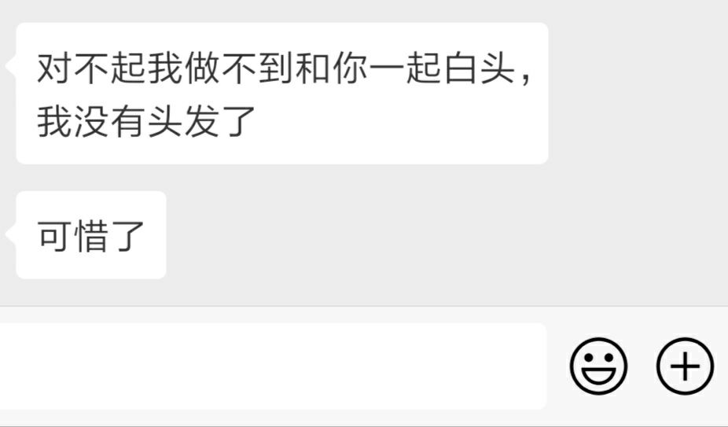
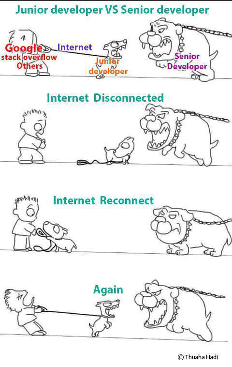
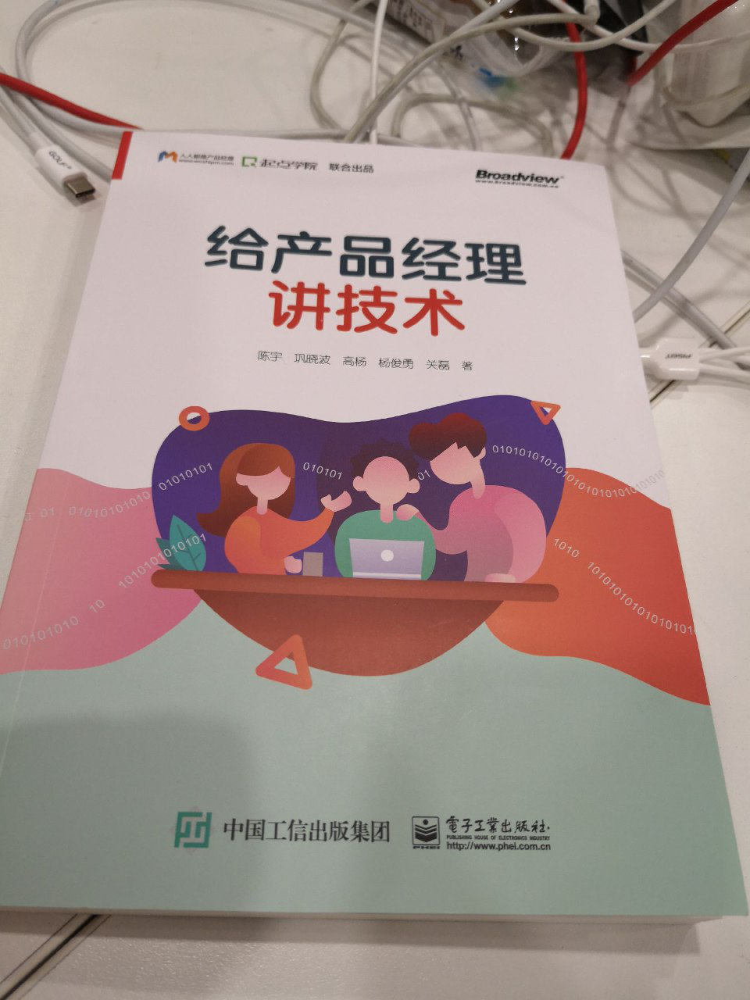
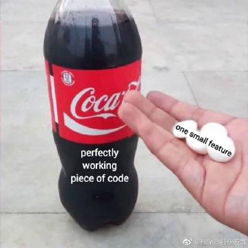
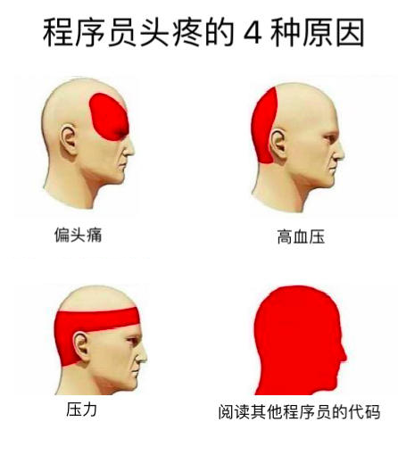
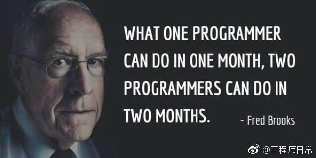

## 码农

> 编程就像魔法。最开始你只会简单的几句咒语，然后用它们慢慢的构筑起了复杂而强大的魔法。有些法师用魔法行善，而有些法师用魔法作恶

## 公司

	图①是初创公司的代码库，那图②是哪类公司呢？
	 
    

## Clothes

> 发现一个程序员家的(宝ᴗ宝)，这定制的衣服有特点……😊

问题来了，她爹/他妈是什么程序员？

## 

## 节日

今天植树节🌲
    画个二叉树庆祝一下吧

## 环境

网络工程师

## 996

## 面试

面试的时候：
- 写个二叉树？
- 什么叫柯里化？
- 什么是高阶函数？
- 解释下循环的工作原理？
- 能现场画一个算法吗……

入职后：

- 帮我们的 App 写个登录功能吧。

## 职位

## 产品经理

   

坑的最里面还有一个PM，PM挖的坑，Programmer正在填坑。

## 需求

> and boom shakalaka
 

small changes

## 头疼

真日常

程序员头疼的 4 种原因 

## 工作

上班时假装忙 8 小时比真的忙 8 小时更累

## 团队

## 恶搞

