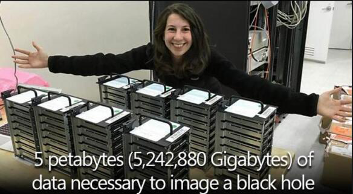
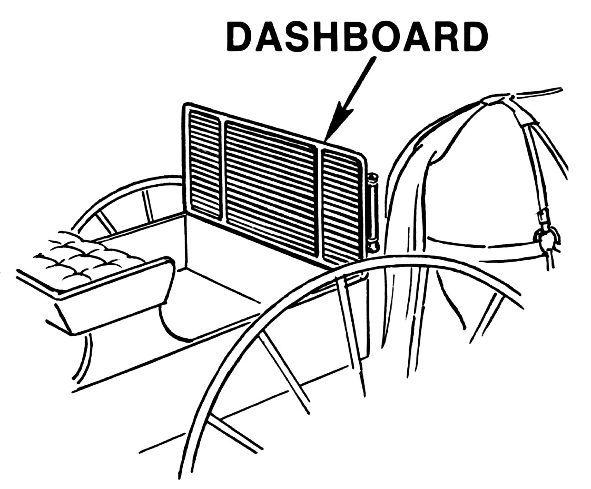

【这一摞代码送人类上月球】
玛格丽特·汉密尔顿，NASA阿波罗项目的首席软件工程师，站在她手写的带领人类在1969年登陆月球的代码旁边。

计算和制作完成黑洞的照片，一共用了5PB（5，242,880Gb）的存储空间来储存数据。

## 冷知识

经常用到dashboard（仪表盘）这个词，对其中dash这个毫不相关的词根有些在意。原来dashboard最早是指马车前面用来挡泥的板子，到了汽车时代用途变成了安装各种仪表的面板，但还是保留了这个名字