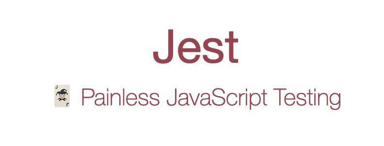
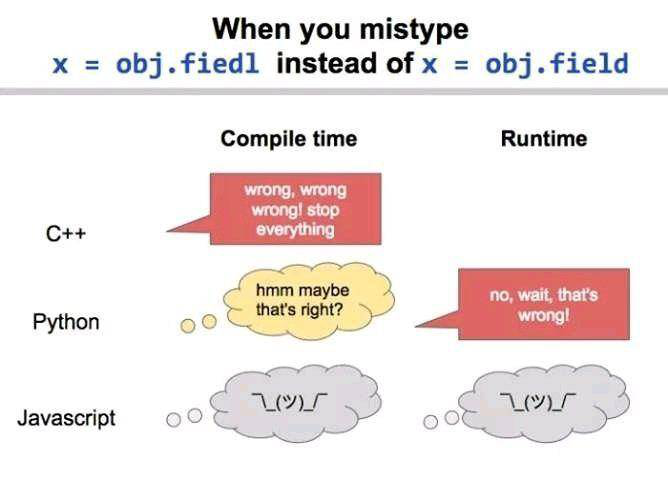

## HTML

 

 > html是骨架，css是肌肉，js是血液

## Javascript

 ( o_o) 诶，你这个地方好像写错了喔~
 (o_o ) 收到收到~

 `({}+{}).length`  NaN == NaN false

这是npm被黑的最惨的一次 

## 浏览器

## 网页

> 电梯就像建筑里的加载页

## 前端 VS 后端

## 网络设备

这是多少口交换机？ 

