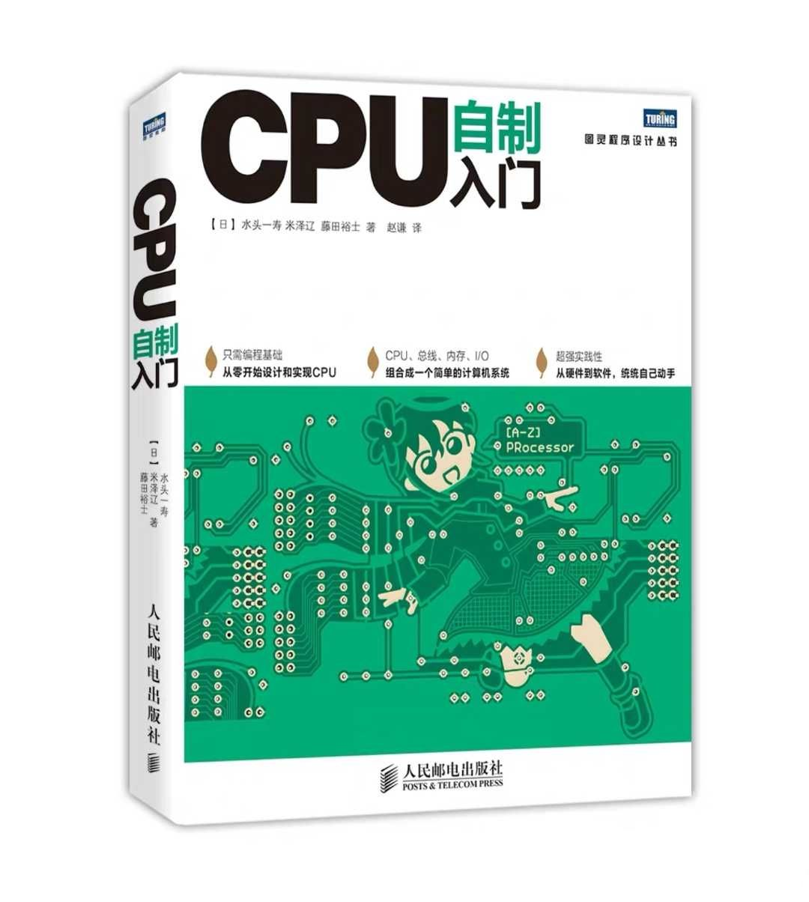
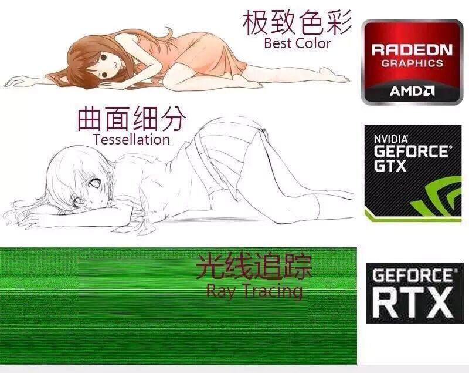
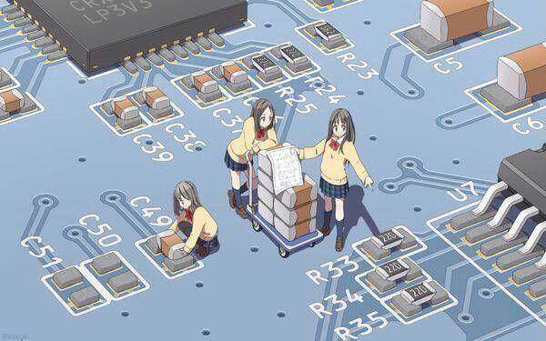
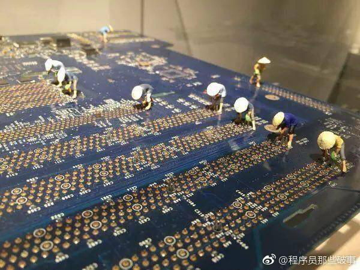

天梯图: https://g.pconline.com.cn/x/diy/tiantitu

桌面CPU、GPU天梯图

- https://g.pconline.com.cn/x/diy/tiantitu/cpu/
- https://g.pconline.com.cn/x/diy/tiantitu/gpu/

手机CPU、GPU天梯图: 

- 综合性能: https://www.socpk.com/
- https://g.pconline.com.cn/x/diy/tiantitu/mcpu/
- https://g.pconline.com.cn/x/diy/tiantitu/mgpu/

## 电脑配置

### CPU

### 显卡

### 主板电路

