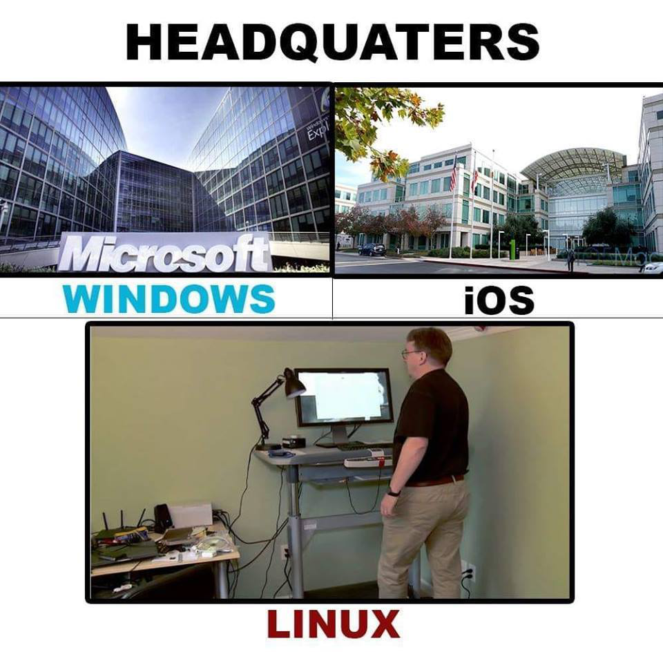
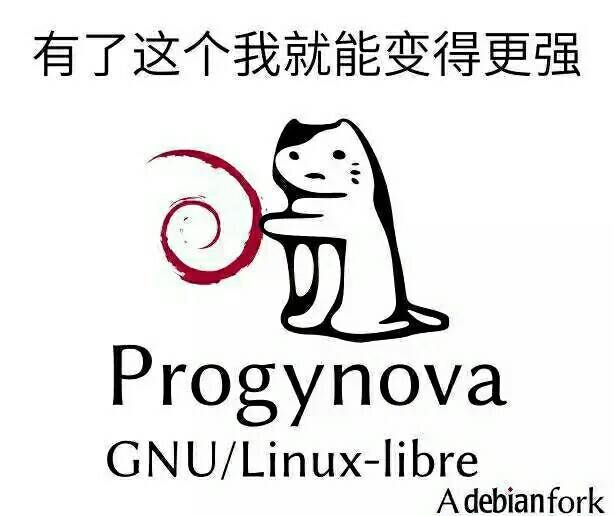
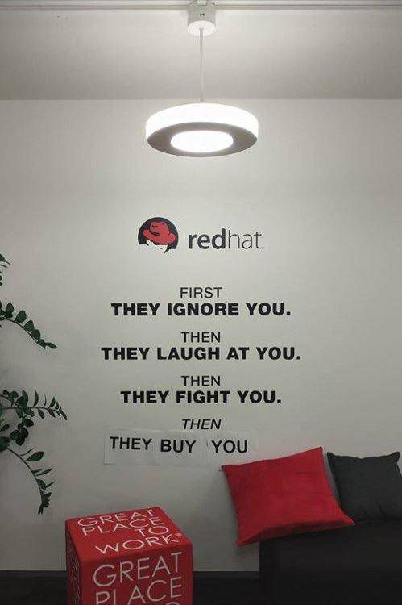
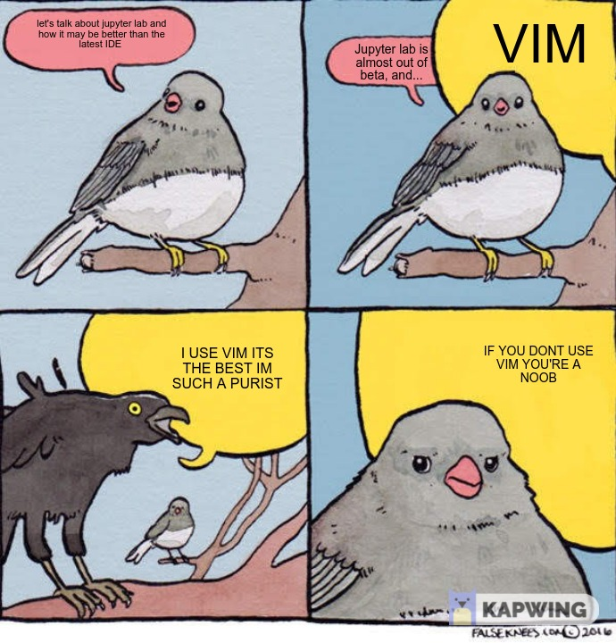
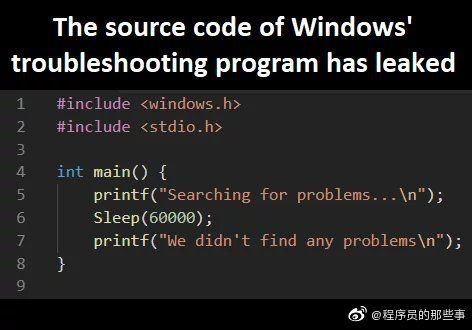

## Linux

Unix是用户友好的，只是要成为Unix的用户很困难。

 

### Linux系统

> 树莓派

### Linux命令

为什么程序员喜爱UNIX:unzip, strip, touch, finger, grep, mount, fsck, more, yes, fsck, fsck, fsck, umount, sleep

> unzip：拉开拉链；strip：脱掉衣服；touch：抚摸；finger：手指；grep：摸索；mount：骑上去；fsck：fxxk；more：更多；yes：爽；umount：下来；sleep：睡觉

> 切换服务`tail -f access.log`，流量突然来了 

> 紧急求助！测试 shutdown 命令导致开机后立马关机 cron

### VIM

> 官方宣布自 2008 年Stack Overflow 平台上线以来，已经帮助超过 180 万人，让他们学会该如何退出 Vim
>
> 问：如何生成一个随机的字符串？答：让新手退出VIM 。

## Windows

重磅！Windows 故障排除程序源码遭到曝光！

> 当任务管理器没有反应的时候😃

