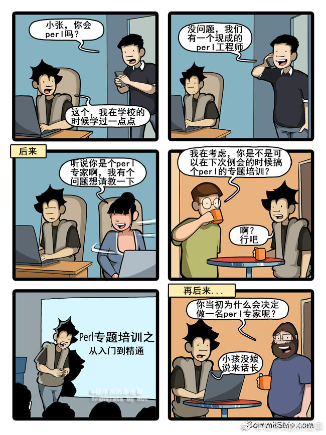
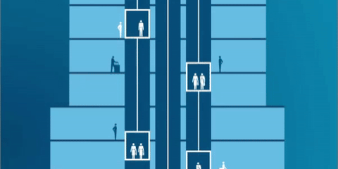

1. 

   程序员最恨四件事：别人不写文档；别人不写注释；自己写文档；自己写注释。

   ——Barret_China

2. Tabs vs spaces 之争一比就弱了

   

3. 

4. 每天困扰程序员的两大问题 

   明明是一样的代码啊为什么我什么都没改就能跑了/为什么他能跑我不能跑

5. 据说这是 GitHub 网红的饭碗

6. 当你写了一晚的程序，终于开始运行的时候…… 

7. 

8. python

   

9. 

10. 码农

11. 术语 猫 Apache tomcat

    

13. 编程就像魔法。最开始你只会简单的几句咒语，然后用它们慢慢的构筑起了复杂而强大的魔法。有些法师用魔法行善，而有些法师用魔法作恶

    

13. 这不是bug，我是故意这么写的！对，不是bug，是特性！
	

14. 代码重用
	

15. 

16. 

17. 

18. and boom shakalaka
	

19. 虽我之死，有子存焉；子又生孙，孙又生子；子又有子，子又有孙；子子孙孙无穷匮也
	
	
	
	
20.  

21. 

22. 

23. 

24. 

25. 双链路冗余备份

左边是第一个，立右边牌子的程序员是为了加“150m”这个提示，提升用户体验，但是他是个半吊子程序员，不会删左边的

26. 

27. `({}+{}).length`  NaN == NaN false

28. 

29. 

30. 上线了一个补丁

31. small changes

    

32. 电梯就像建筑里的加载页

    

33. html是骨架，css是肌肉，js是血液

    

34. 这是多少口交换机？ 
	