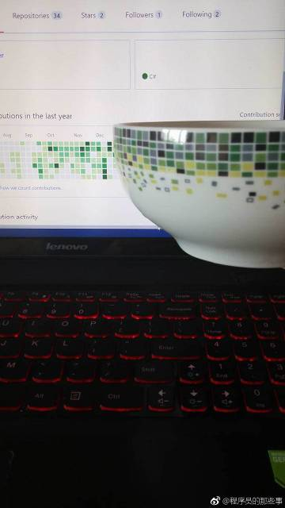
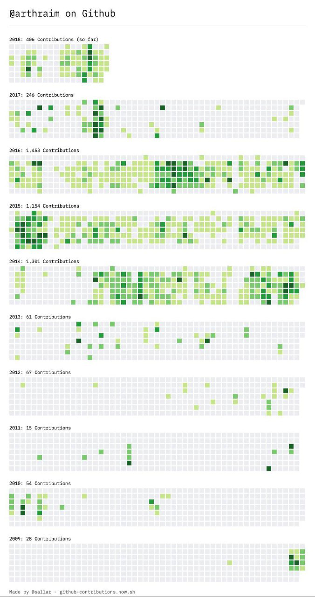

1. 

1. Tabs vs spaces 之争一比就弱了

   

2. 

4. 每天困扰程序员的两大问题 

   明明是一样的代码啊为什么我什么都没改就能跑了/为什么他能跑我不能跑

5. 据说这是 GitHub 网红的饭碗

6. 当你写了一晚的程序，终于开始运行的时候…… 

7. 

8. python

   

9. 

10. 码农

11. 术语 猫 Apache tomcat

    

13. 编程就像魔法。最开始你只会简单的几句咒语，然后用它们慢慢的构筑起了复杂而强大的魔法。有些法师用魔法行善，而有些法师用魔法作恶

    