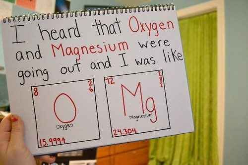
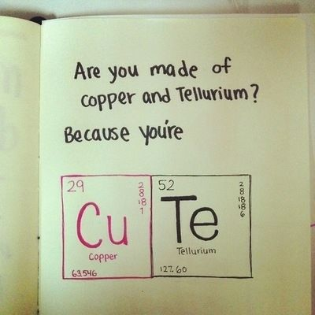
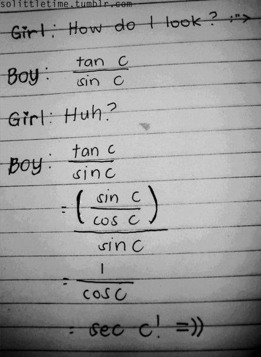
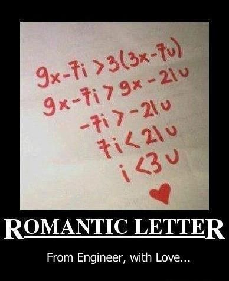
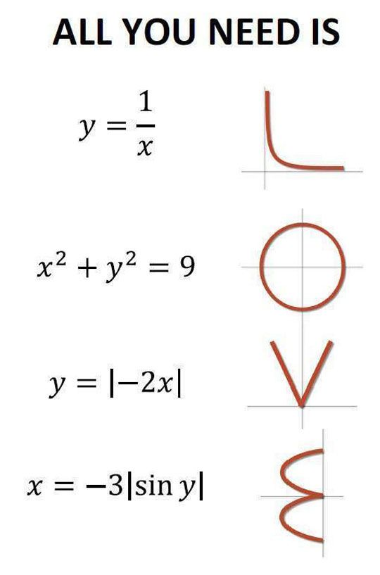
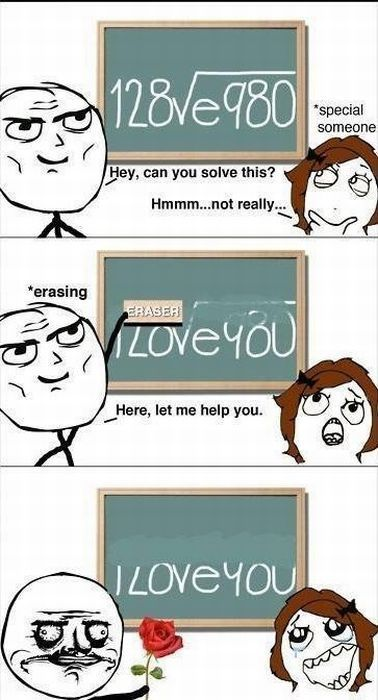

## Chemistry

Do you have 11 protons? 'Cause you're Sodium fine! 
> sodium=so damn fine

二氧化硅的性质不活泼，它不与除氟、氟化氢以外的卤素、卤化氢以及硫酸、硝酸、高氯酸作用(热浓磷酸除外)。6HF+SiO2=H2SiF6+2H2O，你是氢氟酸 我是二氧化硅，我愿溶入你的骨血，好比二氧化硅在常温下独溶于氢氟酸，只此唯一

Mg十ZnSo4==MgSo4+Zn 为什么喜欢我” “因为一个化学方程式, 你的镁夺走了我的锌”

你在我的三十号元素里(注：锌)

## Math

我杀了欧拉 灭了黎曼 只为让平行线相交引力使我靠近你 向心力使我围绕你 而你心里却有斥力，你说你的爱情，像一道复杂的薛定谔方程，不知如何来解

如果你停止追求虚无缥缈的真实解，我就是你最好的近似解

你就像∫f(x′)dx,而我正如f(x),我只不过是你的一个选择,而你却是我唯一的答案

有时候真的希望,你的视线和我的视线,永远是一堆相反向量

失去你我会很失落,因为遇见再喜欢上一个人,它的概率是无数个小事件的概率积

我还是很喜欢你,像sin平方加cos平方,始终如一

我是sin，你是cos。不求平方和，只求tan。

我是sio?,你是hf。他们再强，与我无关，我只要你。

> Sexy

##  Physics

如此慢热的我对你却加速度沦陷

## Biology

I've got my ion you baby! （ion = eye on) 这句在实际操作的过程中应该很难表现吧

We fit together like the sticky ends of recombinant DNA.

Whenever I am near you, I undergo anaerobic respiration （无氧呼吸）because you take my breath away（这句还蛮浪漫的）

You must be the one for me, since my selectively permeable membrane let you
through. (这句有点condescending的意思）

I wish I were Adenine because then I could get paired with U.

> 直白的

You're so hot, you denature my proteins. 

How about me and you go back to my place and form a covalent bond? （=）

You’re like telophase, I admire your cleavage. 有沟必火

> 重口味的

If I were an enzyme, I'd be DNA helicase so I could unzip your genes. （helicase unzip double helix)

You must be gibberelin, because I'm experiencing some stem elongation.
(elongation...邪恶）Didn't you know that chemists do it
periodically on the table? （Do what? 捂脸）

Hey, wanna put your alpha helix in my beta barrel? （helix...barrel...我觉得用around更贴切)

Hey baby, why don't you get your ligase working on my okazaki fragment and
lengthen my strand. （lengthen...)

Do you want to extract some protein from my column? （好像某些东西是蛋白质成分的。。。）

If I was an endoplasmic reticulum, how would you want me: smooth or rough? 矮油。。

We can make a mess as I've hired some lysosomes to clean up after.

 We fit together like the sticky ends of recombinant DNA.

 Whenever I am near you, I undergo anaerobic respiration because you take my breath away.

 You must be the one for me, since my selectively permeable membrane let you through. 

> 这句有点condescending的意思

 I wish I were Adenine because then I could get paired with U.

 You're so hot, you denature my proteins. 

 How about me and you go back to my place and form a covalent bond? （=）

 You’re like telophase, I admire your cleavage. 

> 有沟必火

 If I were an enzyme, I'd be DNA helicase so I could unzip your genes. （helicase unzip double helix)

 You must be gibberelin, because I'm experiencing some stem elongation. (elongation...邪恶）

Didn't you know that chemists do it periodically on the table? （Do what? 捂脸）

 Hey, wanna put your alpha helix in my beta barrel? （helix...barrel...我觉得用around更贴切)

 Hey baby, why don't you get your ligase working on my okazaki fragment and lengthen my strand. （lengthen...)

 If I was an endoplasmic reticulum, how would you want me: smooth or rough? 

 We can make a mess as I've hired some lysosomes to clean up after.

## Medical

你就是癌细胞 在我脑海里 无限增殖