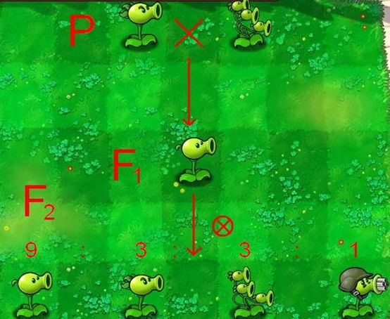

数学是光，点亮物理的灯；物理是灯，照亮化学的路；化学是路，通向生物的坑；生物这个坑，埋葬了我的后半生。

Wish your cells in 20XX with

基因组结构稳定
genome structure stablized；
甲基化程度平衡
methylation level balanced；
线粒体能量提升
mitochondria empowered；
蛋白组协调健康
proteomic regulation normalized；
端粒长度适宜
telomere length adjusted；
有害突变消失
deleterious mutation eliminated；
致死基因沉默
undesirable lethals silenced；
基因互作优化
gene interaction optimized；
不利基因失活
negative genes inactivated；
有利基因 ‘’上位‘’
favorable genes up-regulated；
长寿基因开启
logevity genes initiated；
肾上腺素有序
epinephine secretion programmed；
多巴胺表达充足
dopamine synthesis idealized；
环境适应增强
environmental adaptability enhanced；
代谢途径顺畅
metabolic pathways unobstructed；
基因网络协调
gene networks coordinated；
‘’开心‘’ 因子活跃
“happiness” factors activated !

## 名词解释

巴普洛夫的狗，虐定鄂的猫，孟德尔的豌豆射手,摩尔根的果蝇最后一炮。。。

## 实验

### 实验老鼠

> 你知道作为一只实验室小老鼠，最悲哀的是什么吗？当我以为我在无私的为科学事业献身时，发现其实我只是个对照组。

> “我们称它为导师（principle investigator）型小鼠”

### 生物学实验

一个小偷溜进某生物实验室里，可从他进来，实验室里就有人，于是他找个角落等待他们下班。没想到走了一拨，又来了一拨。他坚持着。等到夜深人静，还有人做实验…他终于熬不住了，偷偷溜了出来。同伙见到忙问：“你呆在哪里那么久收获怎么样？”小偷苦笑道：“别说，我学会提质粒了！”

## 遗传学

## 分子生物学

> 细胞分裂形象解释

