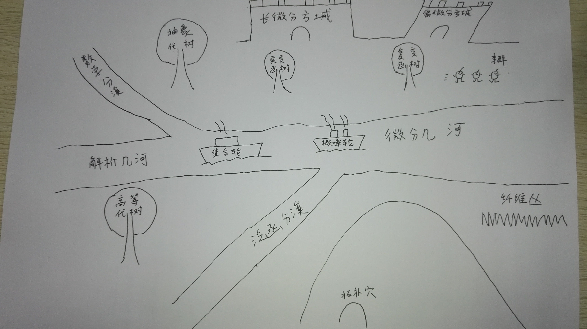

Okay, maybe not. Some of us like math, some of us have hated math ever since we had to learn multiplication tables and long division in school, and some of us sit somewhere in between the two. But none of us can deny that math is a fundamental part of life that we can't get very far without. 

## 函数

Tangerine

Root Beer

