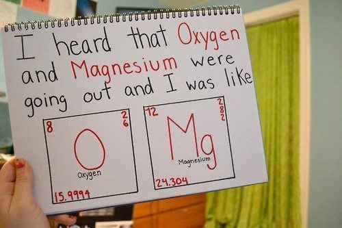
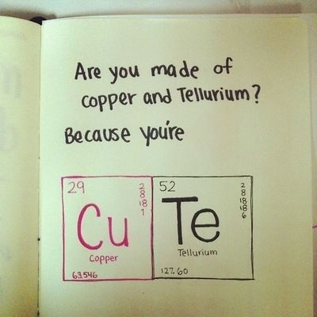
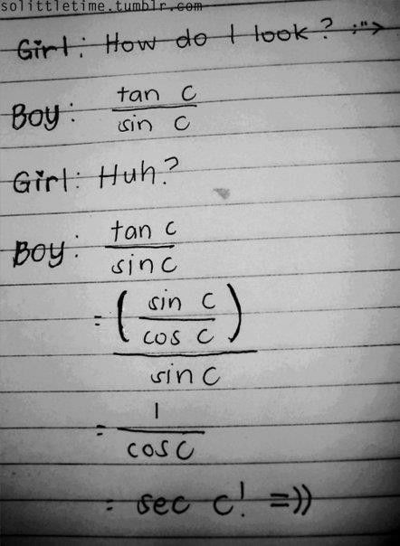
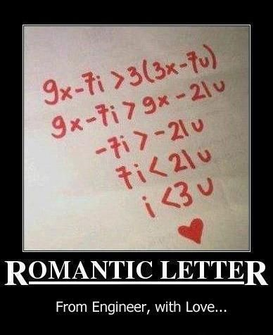
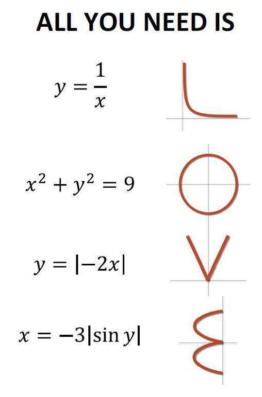
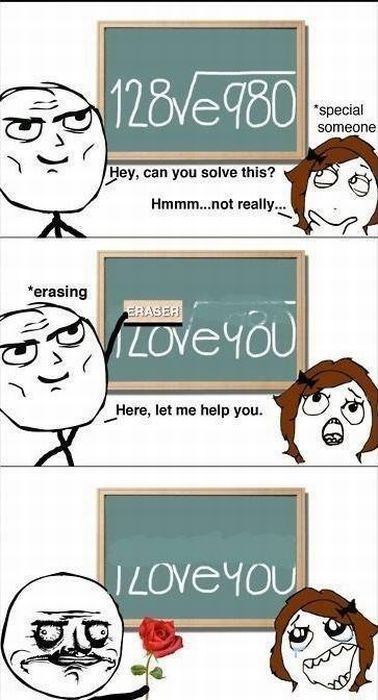

## Chemistry

Do you have 11 protons? 'Cause you're Sodium fine! 
> sodium=so damn fine

## Math

> Sexy

##  Physics

## Biology

 We fit together like the sticky ends of recombinant DNA.

 Whenever I am near you, I undergo anaerobic respiration because you take my breath away.

 You must be the one for me, since my selectively permeable membrane let you through. 

> 这句有点condescending的意思

 I wish I were Adenine because then I could get paired with U.

 You're so hot, you denature my proteins. 

 How about me and you go back to my place and form a covalent bond? （=）

 You’re like telophase, I admire your cleavage. 

> 有沟必火

 If I were an enzyme, I'd be DNA helicase so I could unzip your genes. （helicase unzip double helix)

 You must be gibberelin, because I'm experiencing some stem elongation. (elongation...邪恶）

Didn't you know that chemists do it periodically on the table? （Do what? 捂脸）

 Hey, wanna put your alpha helix in my beta barrel? （helix...barrel...我觉得用around更贴切)

 Hey baby, why don't you get your ligase working on my okazaki fragment and lengthen my strand. （lengthen...)

 If I was an endoplasmic reticulum, how would you want me: smooth or rough? 

 We can make a mess as I've hired some lysosomes to clean up after.